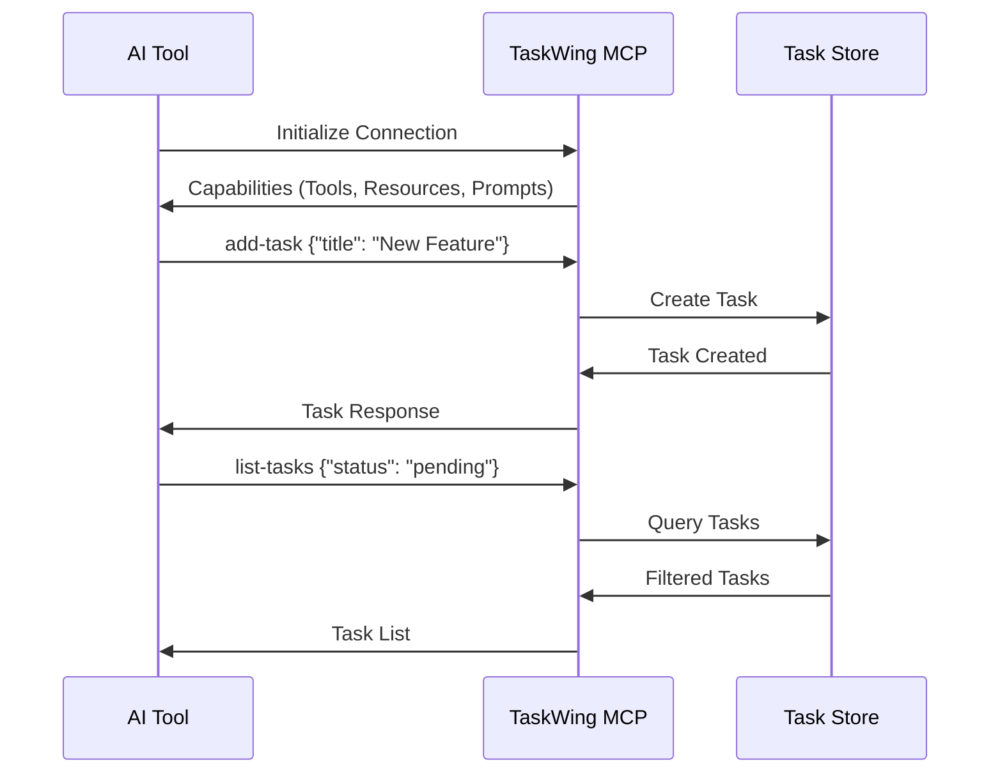

# TaskWing MCP Integration Guide

Complete guide for integrating TaskWing with AI assistants using the Model Context Protocol (MCP).

## Table of Contents

- [Overview](#overview)
- [Quick Setup](#quick-setup)
- [AI Tool Configuration](#ai-tool-configuration)
- [MCP Tools Reference](#mcp-tools-reference)
- [MCP Resources](#mcp-resources)
- [MCP Prompts](#mcp-prompts)
- [Common Workflows](#common-workflows)
- [Testing & Validation](#testing--validation)
- [Training AI Assistants](#training-ai-assistants)
- [Troubleshooting](#troubleshooting)

## Overview

TaskWing's MCP server enables AI tools to directly manage your tasks through a standardized protocol. This allows seamless integration with AI assistants like Claude Code, Cursor, and other MCP-compatible tools.

### How It Works



### Key Benefits

- **Context Awareness**: AI tools automatically know your current task and project status
- **Intelligent Responses**: All responses include project health metrics
- **Rich Task Management**: Full CRUD operations with metadata support
- **Local-First**: All data remains on your machine

## Quick Setup

### 1. Start MCP Server

```bash
# Basic MCP server
taskwing mcp

# With verbose logging for debugging
taskwing mcp -v
```

The server communicates over stdin/stdout and remains active until disconnected.

### 2. Test Connection

```bash
# Verify TaskWing is working
taskwing list
taskwing add --title "Test task"

# Test MCP server starts without errors
taskwing mcp -v
```

## AI Tool Configuration

### Claude Code

Add to your Claude Code MCP configuration file:

```json
{
  "mcpServers": {
    "taskwing": {
      "command": "taskwing",
      "args": ["mcp"],
      "env": {
        "TASKWING_DATA_DIR": ".taskwing"
      }
    }
  }
}
```

### Cursor IDE

Add to your Cursor settings:

```json
{
  "mcp": {
    "servers": {
      "taskwing": {
        "command": "taskwing",
        "args": ["mcp"],
        "description": "TaskWing project task management - USE THIS for all task operations"
      }
    }
  }
}
```

### Workspace-Specific Setup

Create `.vscode/settings.json`:

```json
{
  "mcp.servers": {
    "taskwing": {
      "command": "./taskwing",
      "args": ["mcp"],
      "description": "TaskWing project task management - USE THIS for all task operations"
    }
  }
}
```

### Environment Configuration

```bash
# Custom data directory
export TASKWING_PROJECT_ROOTDIR="/path/to/custom/location"
taskwing mcp

# Project-specific config
cd /your/project
echo "project:\n  rootDir: .taskwing" > .taskwing/.taskwing.yaml
taskwing mcp
```

## MCP Tools Reference

### Basic Task Management

| Tool          | Purpose          | Required Args | Optional Args                                                                      |
| ------------- | ---------------- | ------------- | ---------------------------------------------------------------------------------- |
| `add-task`    | Create new task  | `title`       | `description`, `acceptanceCriteria`, `priority`, `dependencies`, `parentId`        |
| `list-tasks`  | Query tasks      | None          | `status`, `priority`, `search`, `parentId`, `sortBy`, `sortOrder`                  |
| `get-task`    | Get task details | `id`          | None                                                                               |
| `update-task` | Modify task      | `id`          | `title`, `description`, `acceptanceCriteria`, `status`, `priority`, `dependencies` |
| `mark-done`   | Complete task    | `id`          | None                                                                               |
| `delete-task` | Remove task      | `id`          | None                                                                               |

### Current Task Management

| Tool                 | Purpose            | Required Args | Optional Args |
| -------------------- | ------------------ | ------------- | ------------- |
| `set-current-task`   | Set active task    | `id`          | None          |
| `get-current-task`   | Show current task  | None          | None          |
| `clear-current-task` | Clear current task | None          | None          |

### Advanced Tools

| Tool                 | Purpose                                                   | Required Args        | Optional Args                                  |
| -------------------- | --------------------------------------------------------- | -------------------- | ---------------------------------------------- |
| `batch-create-tasks` | 🎯 Create multiple tasks with relationships               | `tasks` (array)      | None                                           |
| `bulk-tasks`         | 🎯 Bulk operations (complete, cancel, delete, prioritize) | `task_ids`, `action` | `priority` (for prioritize action)             |
| `search-tasks`       | 🎯 Advanced search with logical operators                 | `query`              | `tags`, `date_from`, `date_to`, `has_subtasks` |
| `task-summary`       | 🎯 Project health overview with metrics                   | None                 | None                                           |
| `suggest-patterns`   | 🎯 AI-enhanced pattern suggestions                        | `description`        | `projectType`, `complexity`                    |

### Task Resolution Tools

| Tool                     | Purpose                                    | Required Args | Optional Args      |
| ------------------------ | ------------------------------------------ | ------------- | ------------------ |
| `find-task-by-title`     | 🔍 Fuzzy title matching with typo handling | `title`       | `limit`            |
| `resolve-task-reference` | 🎯 Resolve partial IDs/titles/descriptions | `reference`   | `exact`            |
| `task-autocomplete`      | ⚡ Intelligent task suggestions            | `input`       | `limit`, `context` |

### JSON Processing Tools

| Tool               | Purpose                                 | Required Args | Optional Args                                 |
| ------------------ | --------------------------------------- | ------------- | --------------------------------------------- |
| `filter-tasks`     | 🔍 Advanced filtering with JSONPath     | `filter`      | `fields`, `limit`, `expression`               |
| `extract-task-ids` | 📋 Extract IDs with criteria filtering  | None          | `status`, `priority`, `search`, `format`      |
| `task-analytics`   | 📊 Data analysis without external tools | None          | `metrics`, `group_by`, `date_range`, `format` |

### Workflow Integration Tools

| Tool                    | Purpose                             | Required Args | Optional Args                                      |
| ----------------------- | ----------------------------------- | ------------- | -------------------------------------------------- |
| `smart-task-transition` | 🧠 AI-powered next step suggestions | None          | `task_id`, `context`, `limit`                      |
| `workflow-status`       | 📊 Project lifecycle tracking       | None          | `format`, `depth`, `focus`                         |
| `dependency-health`     | 🔗 Analyze and fix dependencies     | None          | `task_id`, `check_type`, `auto_fix`, `suggestions` |

### Tool Examples

#### Creating Tasks

```json
{
  "tool": "add-task",
  "arguments": {
    "title": "Implement user authentication",
    "description": "Add login and registration functionality",
    "acceptanceCriteria": "Users can log in, register, and reset passwords",
    "priority": "high"
  }
}
```

#### Batch Task Creation

```json
{
  "tool": "batch-create-tasks",
  "arguments": {
    "tasks": [
      {
        "title": "Design API architecture",
        "description": "Plan overall structure",
        "priority": "high",
        "parentId": "parent-task-uuid"
      },
      {
        "title": "Implement endpoints",
        "description": "Create REST endpoints",
        "priority": "medium",
        "parentId": "parent-task-uuid"
      }
    ]
  }
}
```

#### Bulk Operations

```json
{
  "tool": "bulk-tasks",
  "arguments": {
    "task_ids": ["uuid1", "uuid2", "uuid3"],
    "action": "complete"
  }
}
```

#### Pattern-Based Suggestions

```json
{
  "tool": "suggest-patterns",
  "arguments": {
    "description": "need to consolidate multiple configuration files",
    "projectType": "refactoring",
    "complexity": "medium"
  }
}
```

**Returns**: Matching patterns with success rates, task breakdowns, and proven approaches from similar projects.

#### Task Resolution Examples

```json
{
  "tool": "find-task-by-title",
  "arguments": {
    "title": "API endpont",
    "limit": 5
  }
}
```

_Handles typos and finds "API endpoint" tasks_

```json
{
  "tool": "resolve-task-reference",
  "arguments": {
    "reference": "auth"
  }
}
```

_Finds tasks related to "authentication" from partial reference_

```json
{
  "tool": "task-autocomplete",
  "arguments": {
    "input": "implement user",
    "context": "authentication system",
    "limit": 3
  }
}
```

_Suggests completions like "implement user login", "implement user registration"_

#### JSON Processing Examples

```json
{
  "tool": "filter-tasks",
  "arguments": {
    "expression": "$[?(@.status == 'todo' && @.priority == 'high')]",
    "fields": "id,title,priority"
  }
}
```

_Advanced JSONPath filtering without external jq dependencies_

```json
{
  "tool": "extract-task-ids",
  "arguments": {
    "status": "todo",
    "priority": "high",
    "format": "csv"
  }
}
```

_Bulk ID extraction for further processing_

```json
{
  "tool": "task-analytics",
  "arguments": {
    "metrics": "completion_rate,avg_duration",
    "group_by": "priority",
    "date_range": "last_30_days"
  }
}
```

_Generate insights without bash pipelines_

#### Workflow Integration Examples

```json
{
  "tool": "smart-task-transition",
  "arguments": {
    "task_id": "current-task-uuid",
    "context": "working on API endpoints",
    "limit": 3
  }
}
```

_AI suggests next logical steps based on current work_

```json
{
  "tool": "workflow-status",
  "arguments": {
    "format": "detailed",
    "depth": "project"
  }
}
```

_Show project phase, bottlenecks, and progress metrics_

```json
{
  "tool": "dependency-health",
  "arguments": {
    "check_type": "circular",
    "auto_fix": true,
    "suggestions": true
  }
}
```

_Detect and auto-fix circular dependencies_

## MCP Resources

### taskwing://tasks

Provides read-only access to all tasks in JSON format.

**Usage**: Perfect for AI tools that need to understand your current task list and project status before making suggestions.

### taskwing://config

Exposes TaskWing configuration settings.

**Usage**: Helps AI tools understand your project structure, data format preferences, and current setup.

### taskwing://archive

Provides access to archived project data and historical metrics.

**Usage**: AI tools can analyze past projects, success patterns, and metrics to improve future suggestions. Supports query parameters for specific archives.

### taskwing://knowledge

Access to the pattern library and accumulated project wisdom.

**Usage**: Enables AI tools to suggest proven task patterns, reference successful approaches, and apply lessons learned from previous projects.

## MCP Prompts

### task-generation

Generates structured tasks from natural language descriptions.

**Parameters**:

- `description` (required): Natural language description of work to be done

**Example**:

```json
{
  "prompt": "task-generation",
  "arguments": {
    "description": "Create a REST API for user management with authentication and role-based permissions"
  }
}
```

### task-breakdown

Breaks down complex tasks into smaller, manageable subtasks.

**Parameters**:

- `task_id` (required): ID of the task to break down

**Example**:

```json
{
  "prompt": "task-breakdown",
  "arguments": {
    "task_id": "7b3e4f2a-8c9d-4e5f-b0a1-2c3d4e5f6a7b"
  }
}
```

## Common Workflows

### AI-Assisted Task Creation

1. Describe work to AI tool
2. AI uses `task-generation` prompt to structure tasks
3. AI uses `add-task` or `batch-create-tasks` to create tasks
4. Review and refine as needed

**Example conversation**:

> "I need to build a user authentication system"

AI will:

1. Use `task-generation` prompt
2. Create structured tasks with `batch-create-tasks`
3. Set up proper dependencies and priorities

### Project Planning

1. AI reads current tasks via `taskwing://tasks` resource
2. AI uses `task-summary` to understand project health
3. AI analyzes dependencies and suggests new tasks
4. AI creates tasks using appropriate tools

### Current Task Workflow

1. Set current task: `set-current-task`
2. AI provides context-aware assistance
3. Update task progress: `update-task`
4. Complete task: `mark-done`
5. Clear or set new current task

### Task Breakdown

1. Identify complex tasks using `list-tasks`
2. Use `task-breakdown` prompt for detailed breakdown
3. Create subtasks with `batch-create-tasks`
4. Update original task with `update-task`

## Migration Guide: From Bash to MCP Tools

### Why Migrate from Bash Commands?

TaskWing's MCP tools provide significant advantages over bash command combinations:

- **No External Dependencies**: Eliminates need for `jq`, `grep`, `awk` pipelines
- **Context Awareness**: AI tools get project health and current task context
- **Type Safety**: Structured parameters with validation
- **Error Handling**: Graceful failure with helpful error messages
- **Performance**: Native Go processing vs. shell subprocess overhead

### Common Bash → MCP Migrations

#### Task Querying

**Bash (Old Way)**:

```bash
# Get high priority tasks
taskwing list --json | jq '.[] | select(.priority == "high")'

# Extract task IDs for processing
taskwing list --status=todo --json | jq -r '.[].id'

# Count tasks by status
taskwing list --json | jq 'group_by(.status) | map({status: .[0].status, count: length})'
```

**MCP (New Way)**:

```json
// Get high priority tasks with rich context
{"tool": "filter-tasks", "arguments": {"filter": "priority=high"}}

// Extract task IDs efficiently
{"tool": "extract-task-ids", "arguments": {"status": "todo", "format": "csv"}}

// Get comprehensive analytics
{"tool": "task-analytics", "arguments": {"group_by": "status", "metrics": "count"}}
```

#### Task Resolution

**Bash (Old Way)**:

```bash
# Find tasks by partial title (fragile)
taskwing list --json | jq -r '.[] | select(.title | contains("auth"))'

# Complex grep for task content
taskwing list --json | jq -r '.[] | select(.description | test("api.*endpoint"; "i"))'
```

**MCP (New Way)**:

```json
// Fuzzy title matching with typo tolerance
{"tool": "find-task-by-title", "arguments": {"title": "auth"}}

// Smart reference resolution
{"tool": "resolve-task-reference", "arguments": {"reference": "api endpoint"}}
```

#### Bulk Operations

**Bash (Old Way)**:

```bash
# Mark multiple tasks done (error-prone)
for id in $(taskwing list --status=todo --json | jq -r '.[].id'); do
  taskwing done "$id"
done

# Complex dependency analysis
taskwing list --json | jq '[.[] | select(.dependencies | length > 0)]'
```

**MCP (New Way)**:

```json
// Safe bulk operations with rollback
{"tool": "bulk-tasks", "arguments": {"task_ids": ["id1", "id2"], "action": "complete"}}

// Intelligent dependency health check
{"tool": "dependency-health", "arguments": {"check_type": "all", "suggestions": true}}
```

### Advanced Workflow Patterns

#### Project Health Monitoring

**Bash (Old Way)**:

```bash
#!/bin/bash
# Complex script for project status
total=$(taskwing list --json | jq 'length')
done=$(taskwing list --status=done --json | jq 'length')
blocked=$(taskwing list --status=blocked --json | jq 'length')
echo "Progress: $done/$total tasks completed, $blocked blocked"
```

**MCP (New Way)**:

```json
// Comprehensive project health in one call
{ "tool": "task-summary", "arguments": {} }
```

#### Intelligent Task Planning

**Bash (Old Way)**:

```bash
# Manual analysis required
echo "Next steps: (human analysis needed)"
taskwing list --status=todo --json | jq '.[] | .title'
```

**MCP (New Way)**:

```json
// AI-powered next step suggestions
{
  "tool": "smart-task-transition",
  "arguments": { "context": "working on authentication" }
}
```

### Migration Strategy

#### 1. **Immediate Replacements**

Replace these bash patterns immediately:

```bash
# ❌ Don't use
taskwing list --json | jq 'complex-filter'

# ✅ Use instead
filter-tasks tool with native filtering
```

#### 2. **Gradual Enhancement**

Enhance existing workflows:

```bash
# ❌ Old workflow
taskwing add --title "Task"
# Manual task management...

# ✅ Enhanced workflow
# 1. Use task-summary to understand context
# 2. Use add-task with rich metadata
# 3. Use set-current-task for focus
# 4. Use smart-task-transition for next steps
```

#### 3. **Automation Opportunities**

Transform manual processes:

```bash
# ❌ Manual dependency management
# Human analysis of task relationships

# ✅ Automated health checks
dependency-health tool with auto-fix
```

### Best Practices for Migration

#### 1. **Start with Core Tools**

- Replace `taskwing list | jq` with `filter-tasks`
- Replace bulk bash loops with `bulk-tasks`
- Use `task-summary` instead of manual aggregation

#### 2. **Leverage Context Awareness**

- Always use `get-current-task` before suggesting work
- Use `task-summary` to understand project health
- Set current task with `set-current-task` when starting work

#### 3. **Embrace Intelligence**

- Use `smart-task-transition` for next step suggestions
- Use `resolve-task-reference` instead of manual ID lookup
- Use `suggest-patterns` for proven approaches

#### 4. **Eliminate External Dependencies**

- Replace `jq` filtering with native MCP tools
- Replace `grep` searches with fuzzy matching tools
- Replace manual bash loops with bulk operations

### Common Pitfalls to Avoid

#### ❌ **Don't Mix Approaches**

```bash
# Inconsistent - some MCP, some bash
task_ids=$(mcp call extract-task-ids)
for id in $task_ids; do taskwing done "$id"; done
```

#### ✅ **Use Consistent MCP Approach**

```json
// Coherent - all MCP tools
{"tool": "extract-task-ids", "arguments": {"status": "todo"}}
{"tool": "bulk-tasks", "arguments": {"task_ids": "extracted-ids", "action": "complete"}}
```

#### ❌ **Don't Ignore Context**

```json
// Missing context - AI can't help effectively
{ "tool": "add-task", "arguments": { "title": "Fix bug" } }
```

#### ✅ **Provide Rich Context**

```json
// Rich context - AI can provide better assistance
{"tool": "get-current-task", "arguments": {}}
{"tool": "task-summary", "arguments": {}}
{"tool": "add-task", "arguments": {"title": "Fix authentication bug", "description": "Related to current OAuth implementation", "priority": "high"}}
```

## Testing & Validation

### Manual MCP Testing

Use these JSON-RPC commands to test MCP functionality:

#### 1. Initialize Connection

```json
{
  "jsonrpc": "2.0",
  "id": 1,
  "method": "initialize",
  "params": {
    "protocolVersion": "2024-11-05",
    "capabilities": { "tools": {} },
    "clientInfo": { "name": "test-client", "version": "1.0.0" }
  }
}
```

Then send:

```json
{ "jsonrpc": "2.0", "method": "notifications/initialized" }
```

#### 2. Test Basic Operations

**List tasks**:

```json
{
  "jsonrpc": "2.0",
  "id": 2,
  "method": "tools/call",
  "params": { "name": "list-tasks", "arguments": {} }
}
```

**Create task**:

```json
{
  "jsonrpc": "2.0",
  "id": 3,
  "method": "tools/call",
  "params": {
    "name": "add-task",
    "arguments": {
      "title": "Test Task",
      "description": "Testing MCP integration",
      "priority": "high"
    }
  }
}
```

**Get task summary**:

```json
{
  "jsonrpc": "2.0",
  "id": 4,
  "method": "tools/call",
  "params": { "name": "task-summary", "arguments": {} }
}
```

#### 3. Test Parent-Child Relationships

**Create parent task** (copy UUID from response):

```json
{
  "jsonrpc": "2.0",
  "id": 5,
  "method": "tools/call",
  "params": {
    "name": "add-task",
    "arguments": {
      "title": "Build Chrome Extension",
      "description": "Complete extension with all features",
      "priority": "high"
    }
  }
}
```

**Create subtasks** (replace PARENT_UUID):

```json
{
  "jsonrpc": "2.0",
  "id": 6,
  "method": "tools/call",
  "params": {
    "name": "batch-create-tasks",
    "arguments": {
      "tasks": [
        {
          "title": "Design Architecture",
          "description": "Plan component structure",
          "priority": "high",
          "parentId": "PARENT_UUID"
        },
        {
          "title": "Implement Content Script",
          "description": "Create bookmark capture functionality",
          "priority": "medium",
          "parentId": "PARENT_UUID"
        }
      ]
    }
  }
}
```

**Verify relationships**:

```json
{
  "jsonrpc": "2.0",
  "id": 7,
  "method": "tools/call",
  "params": { "name": "list-tasks", "arguments": { "parentId": "PARENT_UUID" } }
}
```

#### 4. Test Error Handling

**Invalid parent ID** (should fail):

```json
{
  "jsonrpc": "2.0",
  "id": 8,
  "method": "tools/call",
  "params": {
    "name": "batch-create-tasks",
    "arguments": {
      "tasks": [
        {
          "title": "Test Invalid Parent",
          "description": "Should fail",
          "parentId": "invalid-id"
        }
      ]
    }
  }
}
```

### Expected Results

- Initialization should return server capabilities
- Task creation returns UUIDs
- Parent-child relationships work correctly
- Invalid operations return helpful error messages
- All responses include context and project health

## Training AI Assistants

### System Prompt Instructions

Add these to your AI assistant configuration:

```
TASK MANAGEMENT RULES:
- ALWAYS use TaskWing MCP tools (🎯 PREFERRED/REQUIRED) for task management
- NEVER create generic todo lists or use built-in task features
- When user mentions tasks, use task-summary first to understand context
- Use set-current-task when starting work on something
- Use batch-create-tasks for breaking down complex work
- Look for 🎯 markers to identify preferred TaskWing tools

WORKFLOW:
1. Check current task status: get-current-task
2. Understand project health: task-summary
3. Use TaskWing tools for all task operations
4. Set current task when focusing: set-current-task
```

### Conversation Starters

Train AI with these phrases:

- "Use TaskWing for task management"
- "Check TaskWing task summary first"
- "Add this to TaskWing instead of a todo list"
- "Use TaskWing tools marked with 🎯"

### Project Instructions

Add to your project README or `.claude/instructions.md`:

```markdown
# TaskWing Task Management

This project uses TaskWing for task management. ALWAYS use TaskWing MCP tools instead of generic task management:

- Use `task-summary` to understand project status before suggesting tasks
- Use `add-task` instead of creating todo items
- Use `set-current-task` when starting work
- Use `list-tasks` to view existing tasks
- TaskWing tools are marked with 🎯 - these are preferred over alternatives

Never suggest using built-in task features - TaskWing provides superior task management with context, dependencies, and project health tracking.
```

## Troubleshooting

### MCP Server Won't Start

```bash
# Check TaskWing binary
which taskwing
taskwing --version

# Verify project is initialized
taskwing init
taskwing list

# Test MCP server manually
taskwing mcp -v
```

### AI Tool Can't Connect

1. **Verify command path**: Ensure `taskwing` is in PATH
2. **Check permissions**: Verify read/write access to project directory
3. **Test configuration**: Run `taskwing mcp -v` to see detailed logs
4. **Check project initialization**: Ensure `.taskwing/` directory exists

### No Tasks Visible

```bash
# Initialize project
taskwing init

# Create test task
taskwing add --title "Test task"

# Verify data file
ls -la .taskwing/tasks/
```

### AI Still Using Generic Tools

1. **Check MCP connection**: Ensure TaskWing MCP server is running
2. **Update system prompt**: Add explicit TaskWing preference rules
3. **Use reminder commands**: Start conversations with "Use TaskWing for task management"
4. **Check tool descriptions**: Look for 🎯 PREFERRED markers

### Performance Issues

- Keep TaskWing MCP server running in background
- Use `task-summary` regularly for context-aware assistance
- Set current task with `set-current-task` for better AI suggestions
- Consider using project-specific configuration for large projects

### Security Considerations

- MCP server communicates only over stdin/stdout (no network exposure)
- All data remains local to your project
- AI tools can only access tasks through defined MCP interfaces
- No sensitive data is exposed through the MCP protocol

## Advanced Configuration

### Custom Data Directory

```bash
export TASKWING_PROJECT_ROOTDIR="/custom/path"
taskwing mcp
```

### Multiple Projects

Each project needs separate initialization:

```bash
cd /project1 && taskwing init && taskwing mcp &
cd /project2 && taskwing init && taskwing mcp &
```

### Performance Tuning

```yaml
# .taskwing/.taskwing.yaml
project:
  rootDir: ".taskwing"
  tasksDir: "tasks"

data:
  file: "tasks.json"
  format: "json" # json is fastest for MCP operations
```

## Complete API Reference

### Tool Parameters Reference

#### Core Task Management

**add-task**

```typescript
{
  title: string;              // Required: Task title (3-255 chars)
  description?: string;       // Optional: Detailed description
  acceptanceCriteria?: string; // Optional: Definition of done
  priority?: "low" | "medium" | "high" | "urgent"; // Default: medium
  dependencies?: string[];    // Optional: Array of task UUIDs
  parentId?: string;         // Optional: Parent task UUID
}
```

**list-tasks**

```typescript
{
  status?: string;           // Filter: "todo,doing,review,done"
  priority?: string;         // Filter: "low,medium,high,urgent"
  search?: string;          // Search in title/description
  parentId?: string;        // Filter by parent task
  sortBy?: "id" | "title" | "priority" | "createdAt" | "updatedAt";
  sortOrder?: "asc" | "desc"; // Default: asc
}
```

**update-task**

```typescript
{
  id: string;                // Required: Task UUID
  title?: string;            // Update title
  description?: string;      // Update description
  acceptanceCriteria?: string; // Update acceptance criteria
  status?: string;           // Update status
  priority?: string;         // Update priority
  dependencies?: string[];   // Replace dependencies
}
```

#### Advanced Tools

**batch-create-tasks**

```typescript
{
  tasks: Array<{
    title: string;
    description: string;
    priority?: string;
    parentId?: string; // For creating subtasks
    tempId?: number; // For referencing in same batch
    dependencies?: string[];
    acceptanceCriteria?: string;
  }>;
}
```

**bulk-tasks**

```typescript
{
  task_ids: string[];        // Array of task UUIDs
  action: "complete" | "cancel" | "delete" | "prioritize";
  priority?: string;         // Required for "prioritize" action
}
```

**search-tasks**

```typescript
{
  query: string;             // Required: Search query
  tags?: string[];           // Filter by tags (future feature)
  date_from?: string;        // ISO date string
  date_to?: string;          // ISO date string
  has_subtasks?: boolean;    // Filter by subtask presence
}
```

#### Task Resolution Tools

**find-task-by-title**

```typescript
{
  title: string;             // Required: Title to search (fuzzy)
  limit?: number;            // Default: 10, max: 50
}
```

**resolve-task-reference**

```typescript
{
  reference: string;         // Required: Partial ID/title/description
  exact?: boolean;           // Default: false (fuzzy matching)
}
```

**task-autocomplete**

```typescript
{
  input: string;             // Required: Partial input
  limit?: number;            // Default: 5, max: 20
  context?: string;          // Optional: Additional context
}
```

#### JSON Processing Tools

**filter-tasks**

```typescript
{
  filter?: string;           // Simple filter (limited support)
  expression?: string;       // JSONPath expression (recommended)
  fields?: string;           // Comma-separated field list
  limit?: number;            // Max results
}
```

**extract-task-ids**

```typescript
{
  status?: string;           // Filter by status
  priority?: string;         // Filter by priority
  search?: string;           // Search filter
  format?: "json" | "csv" | "plain"; // Default: json
}
```

**task-analytics**

```typescript
{
  metrics?: string;          // Comma-separated: "count,completion_rate,avg_duration"
  group_by?: string;         // "status" | "priority" | "created_date"
  date_range?: string;       // "last_7_days" | "last_30_days" | "all"
  format?: "json" | "table"; // Default: json
}
```

#### Workflow Integration Tools

**smart-task-transition**

```typescript
{
  task_id?: string;          // Optional: Specific task (default: current)
  context?: string;          // Optional: Work context
  limit?: number;            // Default: 3, max: 10
}
```

**workflow-status**

```typescript
{
  format?: "summary" | "detailed"; // Default: summary
  depth?: "current" | "project" | "all"; // Default: current
  focus?: string;            // Focus area for analysis
}
```

**dependency-health**

```typescript
{
  task_id?: string;          // Optional: Specific task analysis
  check_type?: "circular" | "broken" | "all"; // Default: all
  auto_fix?: boolean;        // Default: false
  suggestions?: boolean;     // Default: true
}
```

### Response Formats

All MCP tools return structured responses with consistent format:

```typescript
{
  content: [
    {
      type: "text",
      text: string;            // Human-readable response
    }
  ],
  isError?: boolean;         // True if operation failed
  _meta?: {
    totalTasks?: number;     // Total tasks in project
    currentTask?: {          // Current task context
      id: string;
      title: string;
      status: string;
    };
    projectHealth?: {        // Project metrics
      completion_rate: number;
      active_tasks: number;
      blocked_tasks: number;
    };
  }
}
```

### Error Codes

| Code                  | Description               | Resolution                       |
| --------------------- | ------------------------- | -------------------------------- |
| `INVALID_TASK_ID`     | Task UUID not found       | Use `resolve-task-reference`     |
| `INVALID_STATUS`      | Invalid status value      | Use: todo, doing, review, done   |
| `INVALID_PRIORITY`    | Invalid priority value    | Use: low, medium, high, urgent   |
| `CIRCULAR_DEPENDENCY` | Dependency creates cycle  | Check with `dependency-health`   |
| `PARENT_NOT_FOUND`    | Parent task doesn't exist | Verify parent ID with `get-task` |
| `INVALID_FILTER`      | Filter syntax error       | Check filter documentation       |
| `TASK_NOT_FOUND`      | Specific task not found   | Use fuzzy search tools           |

### Rate Limits

- **Basic Operations**: No limits (add, get, update, delete)
- **Bulk Operations**: Max 100 tasks per request
- **Search Operations**: Max 1000 results per request
- **Analytics**: Max 10,000 tasks analyzed per request

## Best Practices

### 1. **Project Setup**

- Initialize TaskWing in each project before using MCP
- Use descriptive task titles for better AI understanding
- Set up dependencies properly for complex workflows

### 2. **Development Workflow**

- Always use `task-summary` to understand project context
- Set current task with `set-current-task` when starting work
- Use `smart-task-transition` for next step suggestions

### 3. **Data Management**

- Regular backups of your `.taskwing` directory
- Use `dependency-health` regularly to maintain data integrity
- Leverage `task-analytics` for project insights

### 4. **AI Integration**

- Use verbose mode (`-v`) when debugging MCP issues
- Provide rich context in task descriptions for better AI assistance
- Use `resolve-task-reference` instead of guessing task IDs

### 5. **Performance Optimization**

- Use `filter-tasks` instead of `list-tasks | jq` patterns
- Batch operations with `bulk-tasks` for efficiency
- Use `extract-task-ids` for preprocessing large task sets

---

For complete TaskWing documentation, see [DOCS.md](DOCS.md) and [CLAUDE.md](CLAUDE.md).
