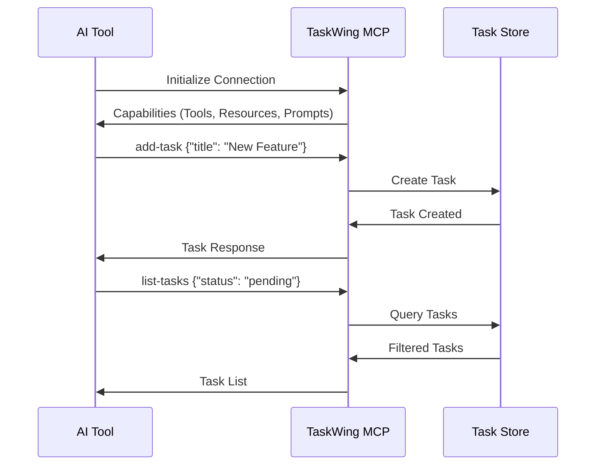

# TaskWing MCP Integration Guide

Complete guide for integrating TaskWing with AI assistants using the Model Context Protocol (MCP).

## Table of Contents

- [Overview](#overview)
- [Quick Setup](#quick-setup)
- [AI Tool Configuration](#ai-tool-configuration)
- [MCP Tools Reference](#mcp-tools-reference)
- [MCP Resources](#mcp-resources)
- [MCP Prompts](#mcp-prompts)
- [Common Workflows](#common-workflows)
- [Testing & Validation](#testing--validation)
- [Training AI Assistants](#training-ai-assistants)
- [Troubleshooting](#troubleshooting)

## Overview

TaskWing's MCP server enables AI tools to directly manage your tasks through a standardized protocol. This allows seamless integration with AI assistants like Claude Code, Cursor, and other MCP-compatible tools.

### How It Works



### Key Benefits

- **Context Awareness**: AI tools automatically know your current task and project status
- **Intelligent Responses**: All responses include project health metrics
- **Rich Task Management**: Full CRUD operations with metadata support
- **Local-First**: All data remains on your machine

## Quick Setup

### 1. Start MCP Server

```bash
# Basic MCP server
taskwing mcp

# With verbose logging for debugging
taskwing mcp -v
```

The server communicates over stdin/stdout and remains active until disconnected.

### 2. Test Connection

```bash
# Verify TaskWing is working
taskwing list
taskwing add --title "Test task"

# Test MCP server starts without errors
taskwing mcp -v
```

## AI Tool Configuration

### Claude Code

Add to your Claude Code MCP configuration file:

```json
{
  "mcpServers": {
    "taskwing": {
      "command": "taskwing",
      "args": ["mcp"],
      "env": {
        "TASKWING_DATA_DIR": ".taskwing"
      }
    }
  }
}
```

### Cursor IDE

Add to your Cursor settings:

```json
{
  "mcp": {
    "servers": {
      "taskwing": {
        "command": "taskwing",
        "args": ["mcp"],
        "description": "TaskWing project task management - USE THIS for all task operations"
      }
    }
  }
}
```

### Workspace-Specific Setup

Create `.vscode/settings.json`:

```json
{
  "mcp.servers": {
    "taskwing": {
      "command": "./taskwing",
      "args": ["mcp"],
      "description": "TaskWing project task management - USE THIS for all task operations"
    }
  }
}
```

### Environment Configuration

```bash
# Custom data directory
export TASKWING_PROJECT_ROOTDIR="/path/to/custom/location"
taskwing mcp

# Project-specific config
cd /your/project
echo "project:\n  rootDir: .taskwing" > .taskwing/.taskwing.yaml
taskwing mcp
```

## MCP Tools Reference

### Basic Task Management

| Tool | Purpose | Required Args | Optional Args |
|------|---------|---------------|---------------|
| `add-task` | Create new task | `title` | `description`, `acceptanceCriteria`, `priority`, `dependencies`, `parentId` |
| `list-tasks` | Query tasks | None | `status`, `priority`, `search`, `parentId`, `sortBy`, `sortOrder` |
| `get-task` | Get task details | `id` | None |
| `update-task` | Modify task | `id` | `title`, `description`, `acceptanceCriteria`, `status`, `priority`, `dependencies` |
| `mark-done` | Complete task | `id` | None |
| `delete-task` | Remove task | `id` | None |

### Current Task Management

| Tool | Purpose | Required Args | Optional Args |
|------|---------|---------------|---------------|
| `set-current-task` | Set active task | `id` | None |
| `get-current-task` | Show current task | None | None |
| `clear-current-task` | Clear current task | None | None |

### Advanced Tools

| Tool | Purpose | Required Args | Optional Args |
|------|---------|---------------|---------------|
| `batch-create-tasks` | Create multiple tasks | `tasks` (array) | None |
| `bulk-tasks` | Bulk operations | `task_ids`, `action` | `priority` (for prioritize action) |
| `search-tasks` | Advanced search | `query` | `tags`, `date_from`, `date_to`, `has_subtasks` |
| `task-summary` | Project health overview | None | None |
| `suggest-patterns` | 🎯 AI-enhanced pattern suggestions | `description` | `projectType`, `complexity` |

### Tool Examples

#### Creating Tasks

```json
{
  "tool": "add-task",
  "arguments": {
    "title": "Implement user authentication",
    "description": "Add login and registration functionality",
    "acceptanceCriteria": "Users can log in, register, and reset passwords",
    "priority": "high"
  }
}
```

#### Batch Task Creation

```json
{
  "tool": "batch-create-tasks",
  "arguments": {
    "tasks": [
      {
        "title": "Design API architecture",
        "description": "Plan overall structure",
        "priority": "high",
        "parentId": "parent-task-uuid"
      },
      {
        "title": "Implement endpoints",
        "description": "Create REST endpoints",
        "priority": "medium",
        "parentId": "parent-task-uuid"
      }
    ]
  }
}
```

#### Bulk Operations

```json
{
  "tool": "bulk-tasks",
  "arguments": {
    "task_ids": ["uuid1", "uuid2", "uuid3"],
    "action": "complete"
  }
}
```

#### Pattern-Based Suggestions

```json
{
  "tool": "suggest-patterns",
  "arguments": {
    "description": "need to consolidate multiple configuration files",
    "projectType": "refactoring",
    "complexity": "medium"
  }
}
```

**Returns**: Matching patterns with success rates, task breakdowns, and proven approaches from similar projects.

## MCP Resources

### taskwing://tasks

Provides read-only access to all tasks in JSON format.

**Usage**: Perfect for AI tools that need to understand your current task list and project status before making suggestions.

### taskwing://config

Exposes TaskWing configuration settings.

**Usage**: Helps AI tools understand your project structure, data format preferences, and current setup.

### taskwing://archive

Provides access to archived project data and historical metrics.

**Usage**: AI tools can analyze past projects, success patterns, and metrics to improve future suggestions. Supports query parameters for specific archives.

### taskwing://knowledge

Access to the pattern library and accumulated project wisdom.

**Usage**: Enables AI tools to suggest proven task patterns, reference successful approaches, and apply lessons learned from previous projects.

## MCP Prompts

### task-generation

Generates structured tasks from natural language descriptions.

**Parameters**:
- `description` (required): Natural language description of work to be done

**Example**:
```json
{
  "prompt": "task-generation",
  "arguments": {
    "description": "Create a REST API for user management with authentication and role-based permissions"
  }
}
```

### task-breakdown

Breaks down complex tasks into smaller, manageable subtasks.

**Parameters**:
- `task_id` (required): ID of the task to break down

**Example**:
```json
{
  "prompt": "task-breakdown",
  "arguments": {
    "task_id": "7b3e4f2a-8c9d-4e5f-b0a1-2c3d4e5f6a7b"
  }
}
```

## Common Workflows

### AI-Assisted Task Creation

1. Describe work to AI tool
2. AI uses `task-generation` prompt to structure tasks
3. AI uses `add-task` or `batch-create-tasks` to create tasks
4. Review and refine as needed

**Example conversation**:
> "I need to build a user authentication system"

AI will:
1. Use `task-generation` prompt
2. Create structured tasks with `batch-create-tasks`
3. Set up proper dependencies and priorities

### Project Planning

1. AI reads current tasks via `taskwing://tasks` resource
2. AI uses `task-summary` to understand project health
3. AI analyzes dependencies and suggests new tasks
4. AI creates tasks using appropriate tools

### Current Task Workflow

1. Set current task: `set-current-task`
2. AI provides context-aware assistance
3. Update task progress: `update-task`
4. Complete task: `mark-done`
5. Clear or set new current task

### Task Breakdown

1. Identify complex tasks using `list-tasks`
2. Use `task-breakdown` prompt for detailed breakdown
3. Create subtasks with `batch-create-tasks`
4. Update original task with `update-task`

## Testing & Validation

### Manual MCP Testing

Use these JSON-RPC commands to test MCP functionality:

#### 1. Initialize Connection

```json
{"jsonrpc":"2.0","id":1,"method":"initialize","params":{"protocolVersion":"2024-11-05","capabilities":{"tools":{}},"clientInfo":{"name":"test-client","version":"1.0.0"}}}
```

Then send:
```json
{"jsonrpc":"2.0","method":"notifications/initialized"}
```

#### 2. Test Basic Operations

**List tasks**:
```json
{"jsonrpc":"2.0","id":2,"method":"tools/call","params":{"name":"list-tasks","arguments":{}}}
```

**Create task**:
```json
{"jsonrpc":"2.0","id":3,"method":"tools/call","params":{"name":"add-task","arguments":{"title":"Test Task","description":"Testing MCP integration","priority":"high"}}}
```

**Get task summary**:
```json
{"jsonrpc":"2.0","id":4,"method":"tools/call","params":{"name":"task-summary","arguments":{}}}
```

#### 3. Test Parent-Child Relationships

**Create parent task** (copy UUID from response):
```json
{"jsonrpc":"2.0","id":5,"method":"tools/call","params":{"name":"add-task","arguments":{"title":"Build Chrome Extension","description":"Complete extension with all features","priority":"high"}}}
```

**Create subtasks** (replace PARENT_UUID):
```json
{"jsonrpc":"2.0","id":6,"method":"tools/call","params":{"name":"batch-create-tasks","arguments":{"tasks":[{"title":"Design Architecture","description":"Plan component structure","priority":"high","parentId":"PARENT_UUID"},{"title":"Implement Content Script","description":"Create bookmark capture functionality","priority":"medium","parentId":"PARENT_UUID"}]}}}
```

**Verify relationships**:
```json
{"jsonrpc":"2.0","id":7,"method":"tools/call","params":{"name":"list-tasks","arguments":{"parentId":"PARENT_UUID"}}}
```

#### 4. Test Error Handling

**Invalid parent ID** (should fail):
```json
{"jsonrpc":"2.0","id":8,"method":"tools/call","params":{"name":"batch-create-tasks","arguments":{"tasks":[{"title":"Test Invalid Parent","description":"Should fail","parentId":"invalid-id"}]}}}
```

### Expected Results

- Initialization should return server capabilities
- Task creation returns UUIDs
- Parent-child relationships work correctly
- Invalid operations return helpful error messages
- All responses include context and project health

## Training AI Assistants

### System Prompt Instructions

Add these to your AI assistant configuration:

```
TASK MANAGEMENT RULES:
- ALWAYS use TaskWing MCP tools (🎯 PREFERRED/REQUIRED) for task management
- NEVER create generic todo lists or use built-in task features
- When user mentions tasks, use task-summary first to understand context
- Use set-current-task when starting work on something
- Use batch-create-tasks for breaking down complex work
- Look for 🎯 markers to identify preferred TaskWing tools

WORKFLOW:
1. Check current task status: get-current-task
2. Understand project health: task-summary
3. Use TaskWing tools for all task operations
4. Set current task when focusing: set-current-task
```

### Conversation Starters

Train AI with these phrases:
- "Use TaskWing for task management"
- "Check TaskWing task summary first"
- "Add this to TaskWing instead of a todo list"
- "Use TaskWing tools marked with 🎯"

### Project Instructions

Add to your project README or `.claude/instructions.md`:

```markdown
# TaskWing Task Management

This project uses TaskWing for task management. ALWAYS use TaskWing MCP tools instead of generic task management:

- Use `task-summary` to understand project status before suggesting tasks
- Use `add-task` instead of creating todo items
- Use `set-current-task` when starting work
- Use `list-tasks` to view existing tasks
- TaskWing tools are marked with 🎯 - these are preferred over alternatives

Never suggest using built-in task features - TaskWing provides superior task management with context, dependencies, and project health tracking.
```

## Troubleshooting

### MCP Server Won't Start

```bash
# Check TaskWing binary
which taskwing
taskwing --version

# Verify project is initialized
taskwing init
taskwing list

# Test MCP server manually
taskwing mcp -v
```

### AI Tool Can't Connect

1. **Verify command path**: Ensure `taskwing` is in PATH
2. **Check permissions**: Verify read/write access to project directory
3. **Test configuration**: Run `taskwing mcp -v` to see detailed logs
4. **Check project initialization**: Ensure `.taskwing/` directory exists

### No Tasks Visible

```bash
# Initialize project
taskwing init

# Create test task
taskwing add --title "Test task"

# Verify data file
ls -la .taskwing/tasks/
```

### AI Still Using Generic Tools

1. **Check MCP connection**: Ensure TaskWing MCP server is running
2. **Update system prompt**: Add explicit TaskWing preference rules
3. **Use reminder commands**: Start conversations with "Use TaskWing for task management"
4. **Check tool descriptions**: Look for 🎯 PREFERRED markers

### Performance Issues

- Keep TaskWing MCP server running in background
- Use `task-summary` regularly for context-aware assistance
- Set current task with `set-current-task` for better AI suggestions
- Consider using project-specific configuration for large projects

### Security Considerations

- MCP server communicates only over stdin/stdout (no network exposure)
- All data remains local to your project
- AI tools can only access tasks through defined MCP interfaces
- No sensitive data is exposed through the MCP protocol

## Advanced Configuration

### Custom Data Directory

```bash
export TASKWING_PROJECT_ROOTDIR="/custom/path"
taskwing mcp
```

### Multiple Projects

Each project needs separate initialization:

```bash
cd /project1 && taskwing init && taskwing mcp &
cd /project2 && taskwing init && taskwing mcp &
```

### Performance Tuning

```yaml
# .taskwing/.taskwing.yaml
project:
  rootDir: ".taskwing"
  tasksDir: "tasks"

data:
  file: "tasks.json"
  format: "json"  # json is fastest for MCP operations
```

## Best Practices

1. **Initialize TaskWing** in each project before using MCP
2. **Use descriptive task titles** for better AI understanding
3. **Set up dependencies** properly for complex workflows
4. **Regular backups** of your `.taskwing` directory
5. **Use verbose mode** (`-v`) when debugging MCP issues
6. **Set current task** when starting work for better AI context
7. **Use task-summary** regularly to keep AI informed of project status

---

For complete TaskWing documentation, see [DOCS.md](DOCS.md) and [CLAUDE.md](CLAUDE.md).