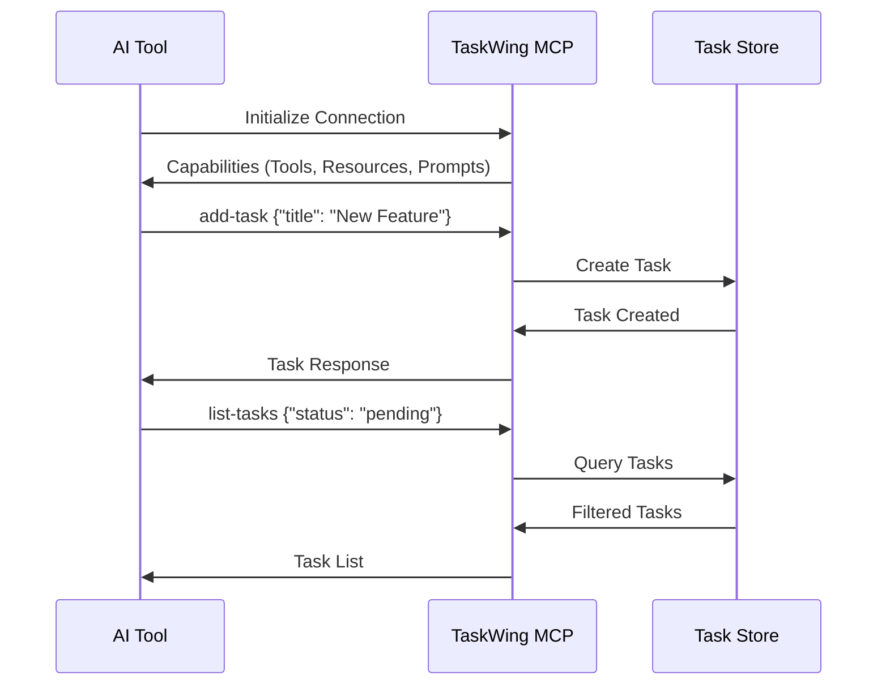

# MCP Integration Guide

This guide explains how to integrate TaskWing with AI tools using the Model Context Protocol (MCP).

## Overview

TaskWing's MCP server enables AI tools to directly manage your tasks through a standardized protocol. This allows for seamless integration with AI assistants like Claude Code, Cursor, and other MCP-compatible tools.



## Quick Setup

### 1. Start MCP Server

```bash
# Start the MCP server
taskwing mcp

# Or with verbose logging for debugging
taskwing mcp -v
```

The server runs over stdin/stdout and will remain active until the AI tool disconnects.

### 2. Configure Your AI Tool

#### Claude Code

Add to your Claude Code MCP configuration file:

```json
{
  "mcpServers": {
    "taskwing": {
      "command": "taskwing",
      "args": ["mcp"],
      "env": {
        "TASKWING_PROJECT_ROOTDIR": ".taskwing"
      }
    }
  }
}
```

#### Cursor IDE

Add to your Cursor settings:

```json
{
  "mcp": {
    "servers": {
      "taskwing": {
        "command": "taskwing",
        "args": ["mcp"]
      }
    }
  }
}
```

#### Other AI Tools

For any MCP-compatible tool, use:

- **Command**: `taskwing`
- **Arguments**: `["mcp"]`
- **Protocol**: stdin/stdout JSON-RPC

## MCP Tools Reference

### Task Management Tools

| Tool          | Purpose          | Required Args | Optional Args                                                                      |
| ------------- | ---------------- | ------------- | ---------------------------------------------------------------------------------- |
| `add-task`    | Create new task  | `title`       | `description`, `acceptanceCriteria`, `priority`, `dependencies`                    |
| `list-tasks`  | Query tasks      | None          | `status`, `priority`, `search`, `parentId`, `sortBy`, `sortOrder`                  |
| `update-task` | Modify task      | `id`          | `title`, `description`, `acceptanceCriteria`, `status`, `priority`, `dependencies` |
| `delete-task` | Remove task      | `id`          | None                                                                               |
| `mark-done`   | Complete task    | `id`          | None                                                                               |
| `get-task`    | Get task details | `id`          | None                                                                               |

### Example Tool Usage

```json
{
  "tool": "add-task",
  "arguments": {
    "title": "Implement user authentication",
    "description": "Add login and registration functionality",
    "acceptanceCriteria": "Users can log in, register, and reset passwords",
    "priority": "high"
  }
}
```

## MCP Resources

### taskwing://tasks

Provides read-only access to all tasks in JSON format.

**Usage**: Perfect for AI tools that need to understand your current task list and project status.

### taskwing://config

Exposes TaskWing configuration settings.

**Usage**: Helps AI tools understand your project structure and preferences.

## MCP Prompts

### task-generation

Generates structured tasks from natural language descriptions.

**Arguments**:

- `description` (required): Natural language description of work to be done

**Example**:

```json
{
  "prompt": "task-generation",
  "arguments": {
    "description": "Create a REST API for user management with authentication"
  }
}
```

### task-breakdown

Breaks down complex tasks into smaller, manageable subtasks.

**Arguments**:

- `task_id` (required): ID of the task to break down

**Example**:

```json
{
  "prompt": "task-breakdown",
  "arguments": {
    "task_id": "abc123-def456-ghi789"
  }
}
```

## Common Workflows

### 1. AI-Assisted Task Creation

1. Describe your work to the AI tool
2. AI uses `task-generation` prompt to create structured tasks
3. AI uses `add-task` tool to create tasks in TaskWing
4. Review and refine tasks as needed

### 2. Project Planning

1. AI reads current tasks via `taskwing://tasks` resource
2. AI analyzes project status and dependencies
3. AI suggests new tasks or modifications
4. AI creates tasks using appropriate tools

### 3. Task Breakdown

1. Identify complex tasks using `list-tasks`
2. Use `task-breakdown` prompt for detailed breakdown
3. Create subtasks with `add-task`
4. Update original task with `update-task`

## Troubleshooting

### MCP Server Won't Start

```bash
# Check TaskWing is properly built
go build -o taskwing main.go

# Ensure TaskWing is initialized
./taskwing init

# Test basic functionality
./taskwing list
```

### AI Tool Can't Connect

1. **Verify command path**: Ensure `taskwing` is in PATH or use absolute path
2. **Check permissions**: Verify TaskWing has read/write access to project directory
3. **Test manually**: Run `taskwing mcp -v` to see detailed logs

### No Tasks Visible

1. **Check initialization**: Run `taskwing init` in your project
2. **Verify data file**: Ensure `.taskwing/tasks/tasks.json` exists
3. **Test with CLI**: Create a task with `taskwing add` and verify with `taskwing list`

## Security

- MCP server communicates only over stdin/stdout (no network exposure)
- All data remains local to your project
- AI tools can only access tasks and configuration through defined MCP interfaces
- No sensitive data is exposed through the MCP protocol

## Advanced Configuration

### Custom Data Directory

```bash
export TASKWING_PROJECT_ROOTDIR="/path/to/custom/location"
taskwing mcp
```

### Project-Specific MCP Setup

Create `.taskwing/.taskwing.yaml`:

```yaml
project:
  rootDir: ".taskwing"
  tasksDir: "tasks"

data:
  file: "tasks.json"
  format: "json"
```

Then start MCP server from the project directory:

```bash
cd /path/to/your/project
taskwing mcp
```

## Best Practices

1. **Initialize TaskWing** in each project before using MCP
2. **Use descriptive task titles** for better AI understanding
3. **Set up dependencies** properly for complex workflows
4. **Regular backups** of your `.taskwing` directory
5. **Use verbose mode** (`-v`) when debugging MCP issues

---

For more information, visit the [TaskWing repository](https://github.com/josephgoksu/taskwing.app).
