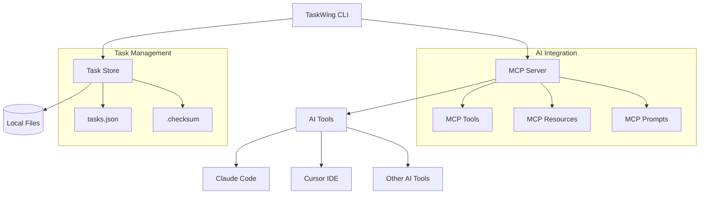
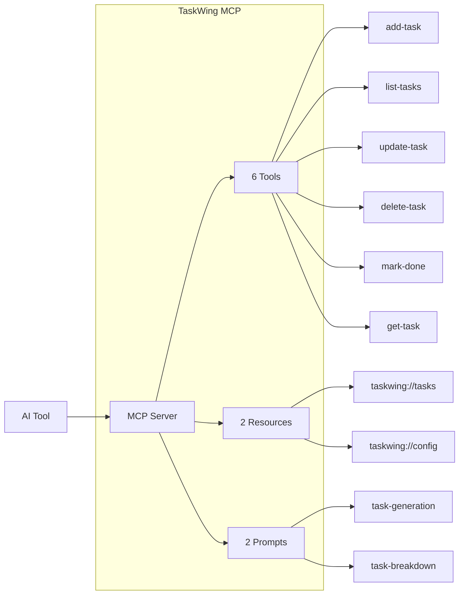

# TaskWing

> AI-assisted CLI task manager for developers

TaskWing is a command-line task management tool designed for developers who want to organize their work efficiently while leveraging AI assistance for better productivity.

## Features

- **📝 Task Management**: Create, update, delete, and track tasks with priorities and dependencies
- **🤖 AI Integration**: Model Context Protocol (MCP) support for seamless AI tool integration
- **🔗 Dependencies**: Manage task relationships and prevent circular dependencies
- **📊 Filtering & Sorting**: Advanced task filtering and customizable sorting options
- **⚡ Fast & Local**: File-based storage with data integrity checks
- **🛠 Developer-Friendly**: Built for command-line workflows

## Quick Start

### Installation

```bash
# Clone the repository
git clone https://github.com/josephgoksu/taskwing.app
cd taskwing.app

# Build the binary
go build -o taskwing main.go

# Optional: Add to PATH
mv ./taskwing /usr/local/bin/
```

### Basic Usage

```bash
# Initialize TaskWing in your project
taskwing init

# Add a new task
taskwing add

# List all tasks
taskwing list

# Mark a task as done
taskwing done [task_id]
```

## Architecture



## Commands

### Core Commands

| Command                | Description                              |
| ---------------------- | ---------------------------------------- |
| `taskwing init`        | Initialize TaskWing in current directory |
| `taskwing add`         | Add a new task (interactive)             |
| `taskwing list`        | List tasks with optional filters         |
| `taskwing update [id]` | Update an existing task                  |
| `taskwing delete [id]` | Delete a task                            |
| `taskwing done [id]`   | Mark task as completed                   |
| `taskwing show [id]`   | Show detailed task information           |

### Filtering & Sorting

```bash
# Filter by status and priority
taskwing list --status pending --priority high

# Search in title and description
taskwing list --search "authentication"

# Sort by creation date
taskwing list --sort-by createdAt --sort-order desc
```

### AI Integration

```bash
# Start MCP server for AI tools
taskwing mcp

# With verbose logging
taskwing mcp -v
```

## AI Integration (MCP)

TaskWing supports the Model Context Protocol, enabling AI tools to directly manage your tasks.

### Supported AI Tools

- **Claude Code** - Direct task management from Claude's interface
- **Cursor IDE** - Task integration within your editor
- **Custom AI Tools** - Any MCP-compatible tool

### Setup for Claude Code

Add to your MCP configuration:

```json
{
  "mcpServers": {
    "taskwing": {
      "command": "taskwing",
      "args": ["mcp"]
    }
  }
}
```

### MCP Capabilities



#### Available Tools

- **add-task**: Create tasks with validation
- **list-tasks**: Query and filter tasks
- **update-task**: Modify existing tasks
- **delete-task**: Remove tasks safely
- **mark-done**: Complete tasks
- **get-task**: Get detailed task info

#### Resources

- **taskwing://tasks**: Access all task data in JSON
- **taskwing://config**: View configuration settings

#### Prompts

- **task-generation**: Generate tasks from descriptions
- **task-breakdown**: Break complex tasks into subtasks

## Configuration

TaskWing uses YAML configuration files with this hierarchy:

1. Project: `.taskwing/.taskwing.yaml`
2. Directory: `./.taskwing.yaml`
3. Home: `$HOME/.taskwing.yaml`

### Key Settings

```yaml
project:
  rootDir: ".taskwing" # TaskWing data directory
  tasksDir: "tasks" # Tasks subdirectory
  outputLogPath: "logs/taskwing.log"

data:
  file: "tasks.json" # Task data file
  format: "json" # json, yaml, or toml
```

Environment variables with `TASKWING_` prefix are also supported.

## Data Storage

TaskWing stores data locally with integrity protection:

- **tasks.json**: Your task data
- **.checksum**: Data integrity validation
- **Locking**: Prevents concurrent modification issues

## Contributing

Contributions are welcome! Please feel free to submit issues and pull requests.

### Development

```bash
# Build and test
go build -o taskwing main.go
go test ./...

# Run with development config
./taskwing init
./taskwing add
```

## License

This project is licensed under the MIT License - see the [LICENSE](LICENSE) file for details.

---

**Built for developers, by developers** 🚀
