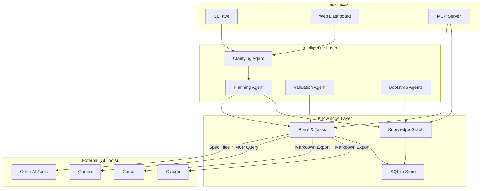
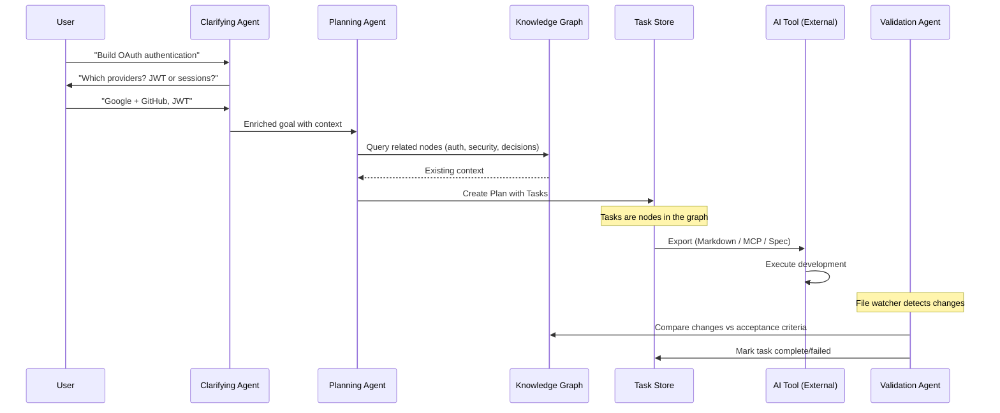
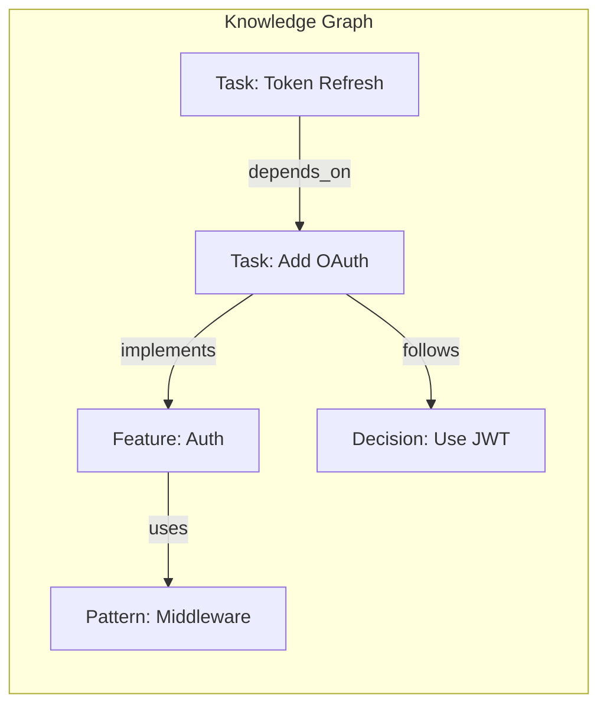
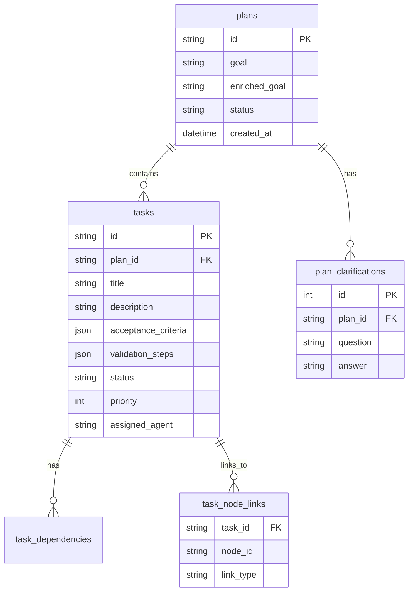

# TaskWing Architecture

> **Version:** 2.x
> **Updated:** 2025-12-23

---

## What is TaskWing?

**TaskWing is a Planning + Knowledge Layer for engineering teams.**

It's NOT an execution engine. It's the intelligence layer that sits between **human intent** and **AI-powered development**.

```
┌──────────────────┐      ┌──────────────────┐      ┌──────────────────┐
│   Human Intent   │ ───▶ │    TaskWing      │ ───▶ │    AI Tools      │
│  "Build OAuth"   │      │ Planning + Context│      │ Claude/Cursor/etc│
└──────────────────┘      └──────────────────┘      └──────────────────┘
```

### Core Value Proposition

| Traditional Tools | TaskWing |
|-------------------|----------|
| Static task lists (Linear, Jira) | **Dynamic plans** enriched with project context |
| Manual task creation | **AI-assisted decomposition** with clarifying questions |
| Isolated from codebase | **Knowledge graph** connects tasks to features, decisions, patterns |
| Designed for humans | **Designed for AI consumption** via MCP, markdown, spec files |

---

## System Architecture



---

## Bootstrap: The Map-Reduce Pipeline

The `bootstrap` command uses a **Map-Reduce architecture** to extract knowledge from a codebase:

```
┌─────────────────────────────────────────────────────────────────────────┐
│                           BOOTSTRAP PIPELINE                            │
├─────────────────────────────────────────────────────────────────────────┤
│                                                                         │
│  ┌─────────────────────────────────────────────────────────────────┐   │
│  │                    MAP PHASE (Parallel Agents)                   │   │
│  │                                                                  │   │
│  │   Orchestrator.RunAll() spawns goroutines:                       │   │
│  │                                                                  │   │
│  │   ┌──────────┐  ┌──────────┐  ┌──────────┐  ┌──────────┐        │   │
│  │   │ DocAgent │  │CodeAgent │  │ GitAgent │  │DepsAgent │        │   │
│  │   │          │  │          │  │          │  │          │        │   │
│  │   │ Features │  │ Patterns │  │Decisions │  │   Deps   │        │   │
│  │   │Constraints│ │   Risks  │  │(commits) │  │ Licenses │        │   │
│  │   └────┬─────┘  └────┬─────┘  └────┬─────┘  └────┬─────┘        │   │
│  │        │             │             │             │               │   │
│  │        └─────────────┴──────┬──────┴─────────────┘               │   │
│  │                             ▼                                    │   │
│  │                    []Finding (raw outputs)                       │   │
│  └─────────────────────────────────────────────────────────────────┘   │
│                                │                                        │
│                                ▼                                        │
│  ┌─────────────────────────────────────────────────────────────────┐   │
│  │                  REDUCE PHASE (Aggregate + Ingest)               │   │
│  │                                                                  │   │
│  │   AggregateFindings()                                            │   │
│  │       └─► Combine all agent outputs into single []Finding        │   │
│  │                                                                  │   │
│  │   KnowledgeService.IngestFindings()                              │   │
│  │       ├─► 1. purgeStaleData()     - Remove old agent nodes       │   │
│  │       ├─► 2. ingestNodes()        - Dedupe + create nodes        │   │
│  │       ├─► 3. ingestStructuredData() - Features/Decisions/etc    │   │
│  │       └─► 4. linkKnowledgeGraph() - Create edges (semantic)      │   │
│  └─────────────────────────────────────────────────────────────────┘   │
│                                │                                        │
│                                ▼                                        │
│                     SQLite Knowledge Graph                              │
└─────────────────────────────────────────────────────────────────────────┘
```

### Agent Responsibilities

| Agent | Analyzes | Extracts |
|-------|----------|----------|
| **DocAgent** | `*.md` files (README, docs/) | Features, **Constraints** (CRITICAL/MUST rules) |
| **ReactCodeAgent** | Source code files | Patterns, Risks, Code structure |
| **GitAgent** | Git history, commits | Decisions, Architecture evolution |
| **DepsAgent** | go.mod, package.json, etc. | Dependencies, Licenses, Tech stack |

### Key Design Principles

1. **Agents are independent** — They don't communicate with each other during analysis
2. **Agents are parallel** — `Orchestrator.RunAll()` uses goroutines for concurrent execution
3. **Deduplication happens centrally** — `ingestNodes()` checks `existingByContent` map
4. **Linking is semantic** — Nodes are connected by cosine similarity of embeddings

### Code References

| Component | File | Function |
|-----------|------|----------|
| Parallel execution | `internal/agents/orchestrator.go` | `RunAll()` |
| Finding aggregation | `internal/agents/orchestrator.go` | `AggregateFindings()` |
| Deduplication | `internal/knowledge/ingest.go` | `ingestNodes()` |
| Node creation | `internal/knowledge/ingest.go` | `IngestFindings()` |
| Graph linking | `internal/knowledge/ingest.go` | `linkKnowledgeGraph()` |


## Information Flow

When a user creates a plan, TaskWing orchestrates the following flow:



---

## Core Concepts

### Tasks are Knowledge Nodes

Unlike traditional task managers, TaskWing tasks live in the knowledge graph:



This means:
- When creating a task, the **full project context** is available
- Tasks can link to existing features, decisions, and patterns
- AI tools get rich context, not just task descriptions

### Validation via File Watching

TaskWing already monitors file changes via its watch functionality. For task validation:

1. **Watch agent** detects file changes after AI execution
2. **Validation agent** compares changes against task acceptance criteria
3. **LLM judgment**: "Did this implementation satisfy the requirements?"
4. Task status updated automatically

---

## Package Structure

```
internal/
├── task/             # Plans, Tasks, and execution
│   ├── models.go     # Task, Plan, TaskStatus
│   ├── store.go      # SQLite persistence
│   └── exporter.go   # Markdown/spec export
├── agents/           # LLM-powered agents
│   ├── clarifying_agent.go   # Asks clarifying questions
│   ├── planning_agent.go     # Decomposes goals into tasks
│   ├── validation_agent.go   # Verifies task completion
│   ├── doc_agent.go          # Documentation analysis
│   ├── react_code_agent.go   # Code pattern detection
│   └── git_deps_agent.go     # Git + dependency analysis
├── knowledge/        # Vector search, embeddings, RAG
├── memory/           # SQLite store + Markdown sync
├── server/           # HTTP API
└── llm/              # Multi-provider (OpenAI, Ollama)

cmd/
├── root.go
├── plan.go           # tw plan new/list/export
├── task.go           # tw task list/validate
├── bootstrap.go      # tw bootstrap
├── context.go        # tw context "query"
└── mcp_server.go     # tw mcp
```

---

## Storage

**SQLite is the source of truth.** Markdown files are human-readable snapshots.



---

## AI Tool Integration

TaskWing feeds AI tools—it doesn't control them.

### Export Options

| Method | Use Case | Status |
|--------|----------|--------|
| **Markdown Export** | Copy/paste into any AI tool | ✅ POC |
| **MCP Server** | AI tools query TaskWing directly | 🚧 Planned |
| **Spec Files** | Store specs in repo (`.taskwing/specs/`) | 🚧 Planned |

### Markdown Export Format

```markdown
# Task: Implement OAuth Callback Handler

**Status:** pending
**Priority:** High
**Depends On:** task-001 (OAuth Config)

## Context
This task implements the callback handler for OAuth flow.
Related to: Feature:Auth, Decision:JWT-over-sessions

## Acceptance Criteria
- [ ] Handle callback from Google OAuth
- [ ] Exchange code for tokens
- [ ] Create/update user record
- [ ] Set JWT cookie

## Validation
```bash
go test ./internal/auth/...
```

## Related Knowledge
- **Decision:** We use JWT over sessions for stateless auth
- **Pattern:** All auth middleware in `internal/middleware/`
```

---

## CLI Commands

### Planning

```bash
tw plan new "Build OAuth authentication"   # Start clarifying flow
tw plan list                                # Show all plans
tw plan show <plan-id>                      # Show plan with tasks
tw plan export <plan-id>                    # Export as markdown
```

### Tasks

```bash
tw task list [--plan-id <id>]     # List tasks (optionally filtered)
tw task show <task-id>            # Show task details + context
tw task validate <task-id>        # Run validation agent
```

### Knowledge

```bash
tw bootstrap                      # Auto-extract knowledge from repo
tw context "error handling"       # Semantic search
tw add "We use Redis for caching" # Add knowledge manually
```

---

## Tech Stack

| Component | Technology |
|-----------|------------|
| CLI | Go 1.24 + Cobra |
| Storage | SQLite (`modernc.org/sqlite`) |
| LLM | CloudWeGo Eino (OpenAI, Ollama) |
| Embeddings | OpenAI text-embedding-3-small |
| MCP | `mcp-go-sdk` |
| Web Dashboard | Vite + React + TypeScript + Tailwind v4 |

---

## Related Documentation

| Document | Purpose |
|----------|---------|
| [ROADMAP.md](./ROADMAP.md) | Version planning |
| [DATA_MODEL.md](./DATA_MODEL.md) | Storage schema details |
| [BOOTSTRAP.md](./BOOTSTRAP.md) | Bootstrap scanner internals |
| [MCP.md](./MCP.md) | MCP integration guide |
