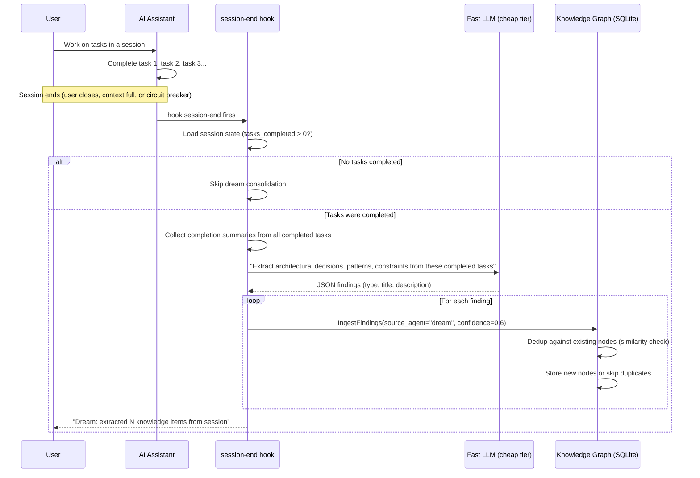
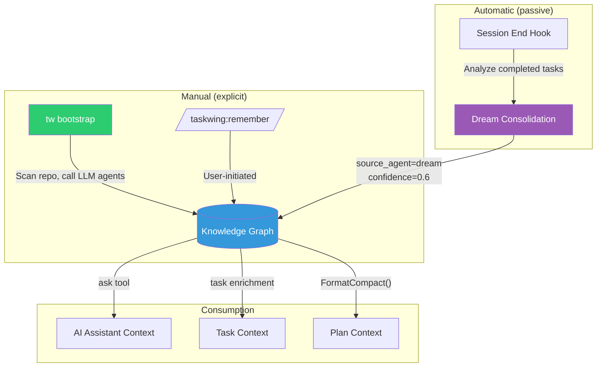

# Dream Consolidation: Passive Knowledge Growth

## How It Works

## Knowledge Flow

## Confidence Tiers

| Source | Agent | Confidence | When |
|---|---|---|---|
| Bootstrap (LLM agents) | doc, code, deps, git | 0.8-1.0 | Explicit `tw bootstrap` run |
| User-initiated | remember | 1.0 | User calls `/taskwing:remember` |
| Dream consolidation | dream | 0.6 | Automatic at session end |

Dream findings have lower confidence because they're inferred from task completion summaries, not from direct code/doc evidence. They won't overwrite higher-confidence bootstrap findings during dedup (UpsertNodeBySummary preserves the higher-confidence version).

## What Gets Extracted

The dream prompt asks the LLM to identify:
- **Decisions**: Technology choices made during the session ("chose Redis over Memcached for caching")
- **Patterns**: Recurring approaches established ("all API handlers follow the middleware chain pattern")
- **Constraints**: Rules discovered or enforced ("never deploy without running the security scan")

Only findings that would be valuable for **future sessions** are extracted. Implementation details, debugging steps, and ephemeral work are filtered by the LLM prompt.
