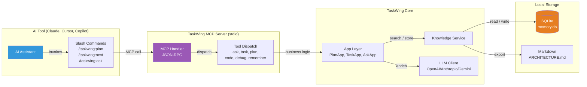
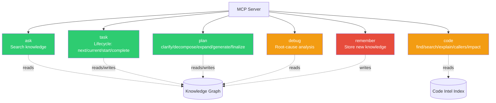
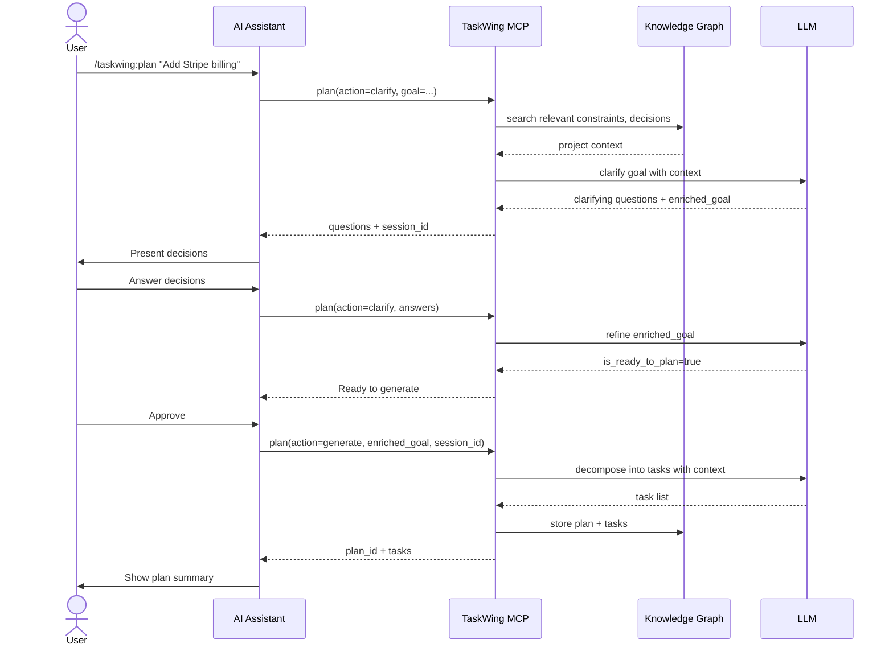
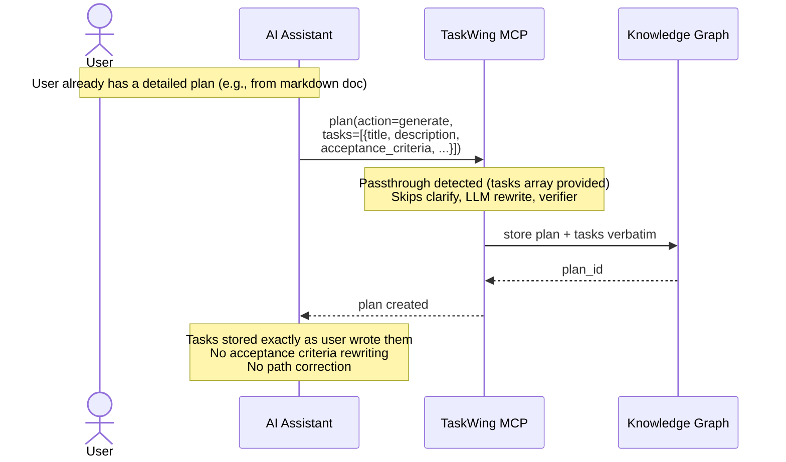
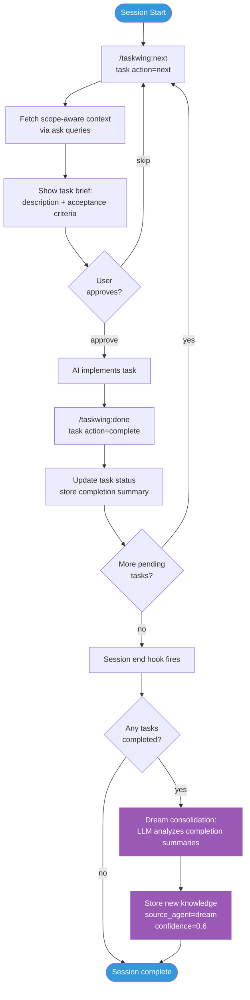
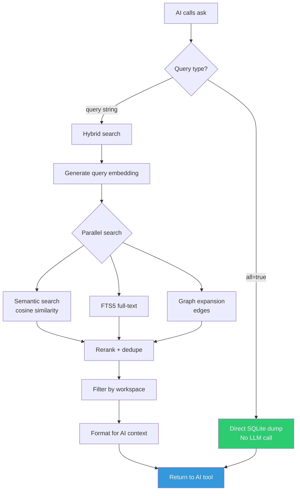
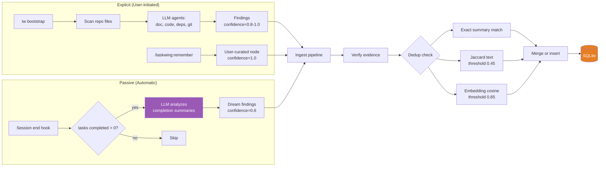
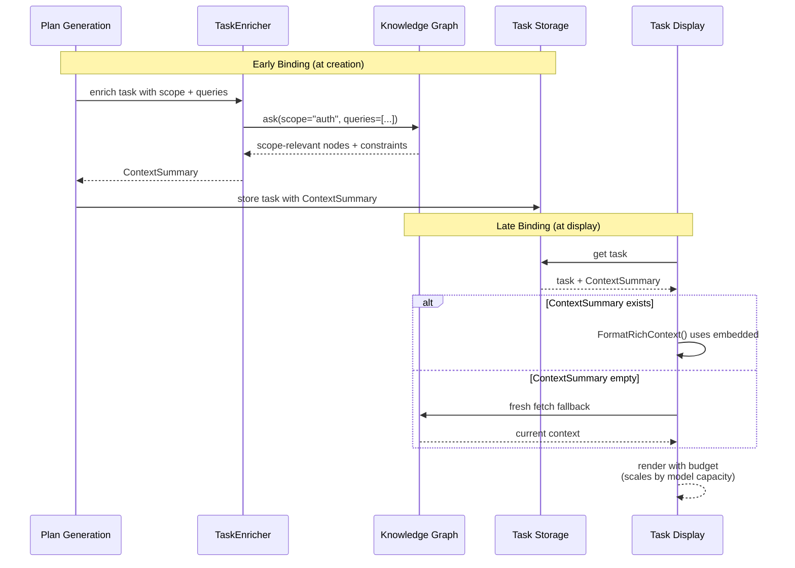

# TaskWing MCP ↔ AI Tool Interaction Flow

How TaskWing exposes project knowledge and task lifecycle to AI coding assistants (Claude Code, Cursor, Copilot, etc.) via the Model Context Protocol.

## High-Level Architecture

## The Six MCP Tools

- **Green**: Knowledge graph operations (read/write nodes)
- **Orange**: Code intelligence (symbols, callers, impact)
- **Red**: Mutation-only (write knowledge)

## Plan Creation Flow (Standard)

## Plan Creation Flow (Passthrough)

## Task Execution Loop

## Ask Tool Flow (Knowledge Search)

## Knowledge Growth Paths

## Context Binding (Early + Late)

## Key Design Principles

1. **Local-first**: All knowledge lives in local SQLite. MCP transport is stdio (no network).
2. **Trust user input**: Passthrough mode preserves user-provided tasks verbatim. No LLM rewriting unless requested.
3. **Hybrid dedup**: Three-layer match (exact → Jaccard → embedding cosine) prevents duplicates across LLM re-runs.
4. **Budget-aware**: Context limits scale with the model's context window (8K to 200K+ tiers).
5. **Passive knowledge growth**: Dream consolidation extracts knowledge from completed work without manual bootstrap.
6. **Workspace scoping**: Partial bootstraps only affect their own workspace, never destroy other repos' nodes.

## Related Documents

- [Dream Consolidation](./DREAM_CONSOLIDATION.md) - Passive knowledge extraction from session end
- [Command Risk Classification](./ADR_COMMAND_RISK_CLASSIFICATION.md) - Future MCP tool safety tiers
- [Context Binding](./ADR_CONTEXT_BINDING.md) - Early + late binding rationale
