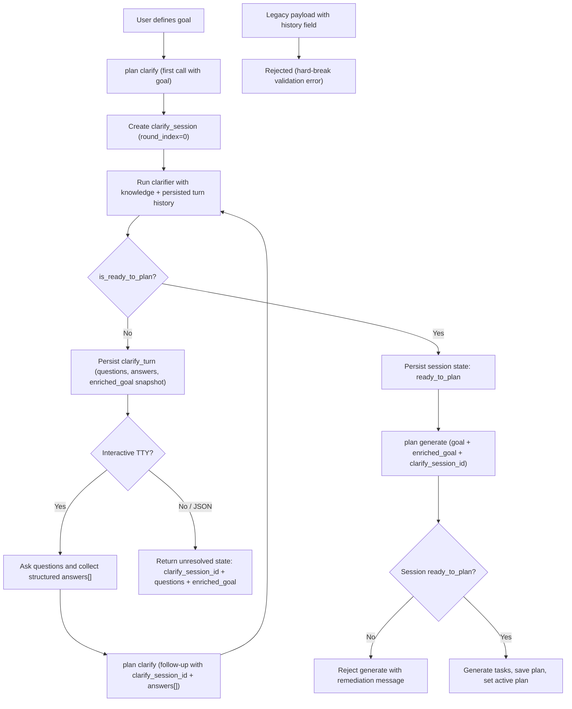
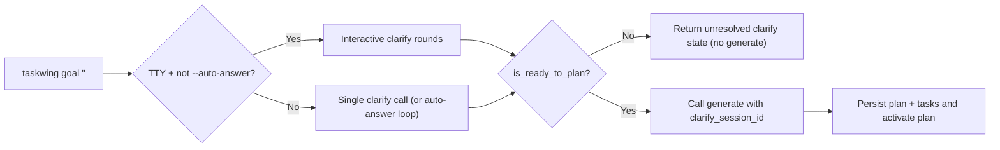

# FORENSIC ARCHITECTURE DOCUMENTATION: TaskWing Planning System

---

## 1. System Identification

| Attribute | Value |
|-----------|-------|
| **System Name** | TaskWing Planning System |
| **Scope** | Goal clarification, plan generation, task lifecycle, deviation detection |
| **Inputs Used** | Source files from `internal/planner/`, `internal/app/`, `internal/memory/`, `internal/task/`, `internal/agents/impl/`, `internal/bootstrap/` |
| **Explicitly NOT Covered** | CLI command implementations (`cmd/`), MCP presenter layer, TUI components, audit agent internals |

---

## 2. High-Level Overview

**What the system does:**
- Converts user goals into structured, validated plans with discrete tasks
- Tracks task execution lifecycle (pending → in_progress → completed)
- Detects deviations between planned and actual file modifications
- Persists all state in SQLite

**When it activates:**
- User invokes `plan new`, `task next`, `task complete`, or MCP tools
- Hook system triggers via Claude Code session management

**What it observes:**
- User-provided goals and answers
- Git working directory state
- Project knowledge context (via recall)

**What it does NOT control:**
- Actual code execution by AI agents
- Git commits (observed but not authored by planning system)
- External LLM provider availability

---

## 3. Phase-Based Architecture (Current State)

### Phase 1: Goal Clarification

| Aspect | Description |
|--------|-------------|
| **Trigger** | `PlanApp.Clarify()` invocation |
| **Actors** | `ClarifyingAgent` (LLM-backed) |
| **Inputs** | First call: `goal`; follow-up calls: `clarify_session_id` + `answers[]`; optional knowledge context |
| **Outputs** | `ClarifyResult` with `clarify_session_id`, `questions[]`, `enriched_goal`, `is_ready_to_plan`, `round_index`, `max_rounds_reached` |
| **Persistence** | Session + turn history persisted in `clarify_sessions` and `clarify_turns` |
| **Control Transfer** | Returns to caller; generation is blocked until `is_ready_to_plan=true` |

**Source:** `internal/app/plan.go`, `internal/memory/task_store.go`, `internal/mcp/types.go`

**Auto-Answer Loop:**
```
┌──────────────────────────────────────────────────────────────────────────┐
│ Clarify start: create session (round 1) and run clarifier               │
└────────────────────┬─────────────────────────────────────────────────────┘
                     │
                     ▼
            ┌────────────────────┐
            │ is_ready_to_plan ? │
            └─────────┬──────────┘
               NO     │      YES
               │      │       │
               ▼      │       ▼
     ┌────────────────────┐  ┌───────────────────────────┐
     │ Persist turn+state │  │ Return ready result       │
     │ Return questions   │  │ allow generate            │
     └─────────┬──────────┘  └───────────────────────────┘
               │
               ▼
   Continue with clarify_session_id + answers[] (or auto_answer)
```

**Conditional Logic (observed):**
- `AutoAnswer=true` AND `len(questions) > 0` AND `!isReady` → enters auto-answer loop
- Maximum 3 auto-answer attempts (`maxAutoAnswerAttempts = 3` at line 193)
- Loop exits if LLM returns empty answer or error

---

### Phase 2: Plan Generation

| Aspect | Description |
|--------|-------------|
| **Trigger** | `PlanApp.Generate()` invocation |
| **Actors** | `PlanningAgent`, `SemanticMiddleware`, `PlanVerifier` |
| **Inputs** | `goal`, `enriched_goal` (required), knowledge context |
| **Outputs** | `GenerateResult` with `tasks[]`, `plan_id`, semantic warnings/errors |
| **Persistence** | SQLite `plans` and `tasks` tables (if `Save=true`) |
| **Control Transfer** | Plan set as active; control returns to caller |

**Source:** `internal/app/plan.go:237-517`

**Pipeline Diagram:**
```
┌─────────────────────────────────────────────────────────────────────┐
│                      Generate(goal, enriched_goal)                  │
└──────────────────────────────┬──────────────────────────────────────┘
                               │
                               ▼
                    ┌──────────────────────┐
                    │  PlanningAgent.Run() │
                    │  (LLM decomposition) │
                    └──────────┬───────────┘
                               │
                               ▼
                    ┌──────────────────────┐
                    │ parseTasksFromMeta() │
                    │ (resolve deps by     │
                    │  title → ID)         │
                    └──────────┬───────────┘
                               │
                               ▼
                    ┌──────────────────────┐
                    │ Task.Validate()      │
                    │ per task             │
                    └──────────┬───────────┘
                               │
                               ▼
                    ┌──────────────────────┐
                    │ SemanticMiddleware   │
                    │ .Validate()          │
                    │ (file paths, shell)  │
                    └──────────┬───────────┘
                               │
                               ▼
                    ┌──────────────────────┐
                    │ PlanVerifier.Verify()│
                    │ (codeintel          │
                    │  auto-correction)    │
                    └──────────┬───────────┘
                               │
                               ▼
                    ┌──────────────────────┐
                    │ repo.CreatePlan()    │
                    │ (atomic SQLite TX)   │
                    └──────────┬───────────┘
                               │
                               ▼
                    ┌──────────────────────┐
                    │ repo.SetActivePlan() │
                    │ (demote others)      │
                    └──────────────────────┘
```

**Dependency Resolution (observed behavior):**
1. LLM returns `dependencies` as task title strings
2. `parseTasksFromMetadata()` generates UUIDs immediately: `task-{uuid[:8]}`
3. Builds `titleToID` map during first pass
4. Second pass resolves title strings to IDs
5. If title not found in map: dependency silently dropped

**Source:** `internal/app/plan.go:711-843`

---

### Phase 3: Task Claiming

| Aspect | Description |
|--------|-------------|
| **Trigger** | `TaskApp.Next()` or `TaskApp.Start()` |
| **Actors** | TaskApp, Repository, GitVerifier |
| **Inputs** | `plan_id` (optional), `session_id`, `auto_start`, `create_branch` |
| **Outputs** | `TaskResult` with claimed task, git branch info |
| **Persistence** | `tasks.status`, `claimed_by`, `claimed_at`, `git_baseline` |
| **Control Transfer** | Task marked `in_progress`; agent begins work |

**Source:** `internal/app/task.go:78-191`, `internal/memory/task_store.go:698-735`

**Next Task Selection SQL:**
```sql
SELECT ... FROM tasks t
WHERE t.plan_id = ? AND t.status = 'pending'
AND NOT EXISTS (
    SELECT 1 FROM task_dependencies td
    JOIN tasks dep ON dep.id = td.depends_on
    WHERE td.task_id = t.id AND dep.status != 'completed'
)
ORDER BY t.priority ASC, t.created_at ASC
LIMIT 1
```

**Git Baseline Capture:**
- If `auto_start=true` AND directory is git repo
- Calls `GitVerifier.GetActualModifications()`
- Stores JSON array in `tasks.git_baseline`
- Purpose: Exclude pre-existing modifications from deviation detection

**Source:** `internal/app/task.go:156-164`

---

### Phase 4: Task Completion

| Aspect | Description |
|--------|-------------|
| **Trigger** | `TaskApp.Complete()` |
| **Actors** | TaskApp, Sentinel, AuditService (if all tasks done), GitClient |
| **Inputs** | `task_id`, `summary`, `files_modified[]` |
| **Outputs** | `TaskResult` with sentinel report, audit status, optional PR URL |
| **Persistence** | `tasks.status`, `completion_summary`, `files_modified`, `completed_at`; `plans.status`, `last_audit_report` |
| **Control Transfer** | If all tasks complete → audit → optional PR |

**Source:** `internal/app/task.go:337-548`

**Completion Flow:**
```
┌──────────────────────────────────────────────────────────────────┐
│                Complete(task_id, summary, files)                 │
└─────────────────────────────┬────────────────────────────────────┘
                              │
                              ▼
                   ┌─────────────────────┐
                   │repo.CompleteTask()  │
                   │(status=completed)   │
                   └──────────┬──────────┘
                              │
                              ▼
                   ┌─────────────────────┐
                   │Sentinel.Analyze     │
                   │WithVerification()   │
                   └──────────┬──────────┘
                              │
                              ▼
                   ┌─────────────────────┐
                   │Git commit+push      │
                   │(best-effort)        │
                   └──────────┬──────────┘
                              │
                              ▼
                ┌─────────────────────────┐
                │ All tasks completed?    │
                └─────────┬───────────────┘
                     NO   │   YES
                     │    │    │
                     ▼    │    ▼
               ┌─────┐    │  ┌────────────────────────┐
               │Done │    │  │AuditService.Audit     │
               └─────┘    │  │WithAutoFix(plan)      │
                          │  └──────────┬────────────┘
                          │             │
                          │             ▼
                          │  ┌────────────────────────┐
                          │  │If audit passed:       │
                          │  │GitClient.CreatePlanPR │
                          │  └──────────────────────────┘
```

---

### Phase 5: Deviation Detection (Sentinel)

| Aspect | Description |
|--------|-------------|
| **Trigger** | Called during `Complete()` |
| **Actors** | `Sentinel`, `GitVerifier` |
| **Inputs** | `Task` (with `expected_files`, `files_modified`, `git_baseline`) |
| **Outputs** | `SentinelReport` with deviations, severity, verification status |
| **Persistence** | Report included in `TaskResult`; not persisted separately |
| **Control Transfer** | Report returned to caller for display |

**Source:** `internal/task/sentinel.go`, `internal/task/git_verifier.go`

**Deviation Types (observed):**
| Type | Meaning |
|------|---------|
| `drift` | File modified but not in `expected_files` |
| `missing` | Expected file not in `files_modified` |
| `unreported` | Git found modification not in `files_modified` (agent may have lied) |
| `over_reported` | Claimed modification not detected by git (hallucination) |

**Severity Classification:**
```
IF isHighRiskFile(file):
    return SeverityError
ELSE IF driftCount >= DriftErrorThreshold (5):
    return SeverityError
ELSE IF driftCount >= DriftWarningThreshold (2):
    return SeverityWarning
ELSE:
    return SeverityInfo
```

**High-Risk File Patterns:**
`config`, `.env`, `secret`, `credential`, `auth`, `security`, `password`, `token`, `migration`, `schema`

**Source:** `internal/task/sentinel.go:157-171`

---

## 4. Data Artifacts & State

### 4.1 Plan

| Field | Type | Source | Storage | Lifecycle | Consumers |
|-------|------|--------|---------|-----------|-----------|
| `ID` | string | Auto-generated `plan-{uuid[:8]}` | `plans.id` | Immutable | All plan queries |
| `Goal` | string | User input or AI summary (max 100 chars) | `plans.goal` | Mutable via update | UI display |
| `EnrichedGoal` | string | ClarifyingAgent output | `plans.enriched_goal` | Mutable via update | Task generation |
| `Status` | PlanStatus | State machine | `plans.status` | Transitions: draft→active→completed→verified/needs_revision→archived | Queries, UI |
| `Tasks` | []Task | PlanningAgent | `tasks` table (FK) | Created with plan | Task lifecycle |
| `LastAuditReport` | string (JSON) | AuditService | `plans.last_audit_report` | Updated on audit | Audit history |

**Schema (SQLite):**
```sql
CREATE TABLE plans (
    id TEXT PRIMARY KEY,
    goal TEXT,
    enriched_goal TEXT,
    status TEXT,
    created_at TEXT,
    updated_at TEXT,
    last_audit_report TEXT
);
```

### 4.2 Task

| Field | Type | Source | Storage | Lifecycle | Consumers |
|-------|------|--------|---------|-----------|-----------|
| `ID` | string | Auto-generated `task-{uuid[:8]}` | `tasks.id` | Immutable | All task queries |
| `PlanID` | string | Parent plan | `tasks.plan_id` | Immutable | FK constraint |
| `Status` | TaskStatus | State machine | `tasks.status` | pending→in_progress→completed/failed | Scheduling |
| `Priority` | int | LLM (0-100, lower=higher) | `tasks.priority` | Immutable | GetNextTask ordering |
| `ExpectedFiles` | []string | LLM prediction | `tasks.expected_files` (JSON) | Immutable | Sentinel |
| `FilesModified` | []string | Agent claim | `tasks.files_modified` (JSON) | Set on complete | Sentinel |
| `GitBaseline` | []string | GitVerifier snapshot | `tasks.git_baseline` (JSON) | Set on claim | Sentinel |
| `ClaimedBy` | string | Session ID | `tasks.claimed_by` | Set on claim | Session tracking |
| `Dependencies` | []string | LLM (resolved) | `task_dependencies` table | Immutable | GetNextTask |

**Schema (SQLite):**
```sql
CREATE TABLE tasks (
    id TEXT PRIMARY KEY,
    plan_id TEXT REFERENCES plans(id) ON DELETE CASCADE,
    title TEXT,
    description TEXT,
    acceptance_criteria TEXT,  -- JSON array
    validation_steps TEXT,      -- JSON array
    status TEXT,
    priority INTEGER,
    complexity TEXT,
    assigned_agent TEXT,
    parent_task_id TEXT,
    context_summary TEXT,
    scope TEXT,
    keywords TEXT,              -- JSON array
    suggested_recall_queries TEXT,  -- JSON array
    claimed_by TEXT,
    claimed_at TEXT,
    completed_at TEXT,
    completion_summary TEXT,
    files_modified TEXT,        -- JSON array
    expected_files TEXT,        -- JSON array
    git_baseline TEXT,          -- JSON array
    created_at TEXT,
    updated_at TEXT
);

CREATE TABLE task_dependencies (
    task_id TEXT REFERENCES tasks(id) ON DELETE CASCADE,
    depends_on TEXT REFERENCES tasks(id) ON DELETE CASCADE,
    PRIMARY KEY (task_id, depends_on)
);
```

### 4.3 SentinelReport

| Field | Type | Source | Lifecycle |
|-------|------|--------|-----------|
| `TaskID` | string | Input | Report creation |
| `ExpectedFiles` | []string | Task.ExpectedFiles | Snapshot |
| `ActualFiles` | []string | Task.FilesModified | Snapshot |
| `Deviations` | []Deviation | Analysis | Report creation |
| `DeviationRate` | float64 | Calculated (1 - matches/union) | Report creation |
| `GitVerification` | *VerificationResult | GitVerifier | Optional |
| `VerificationStatus` | string | Git check | verified/unavailable/skipped |

**Not persisted to database. Returned in TaskResult and displayed to user.**

---

## 5. LLM Validation & Retry Logic

### 5.1 Schema Validation

**Source:** `internal/planner/schema.go`

| Schema | Required Fields | Constraints |
|--------|-----------------|-------------|
| `LLMPlanResponse` | `goal_summary`, `rationale`, `tasks`, `estimated_complexity` | tasks: 1-50 items; goal_summary: max 100 chars; rationale: min 20 chars |
| `LLMTaskSchema` | `title`, `description`, `priority`, `complexity`, `assigned_agent`, `acceptance_criteria` | title: max 200 chars; priority: 0-100; complexity: low/medium/high; assigned_agent: coder/qa/architect/researcher |
| `LLMClarificationResponse` | `goal_summary` | Conditional: if `is_ready_to_plan=true` → `enriched_goal` required; if false → `questions` required |

**Custom Validators:**
- `priority_range`: `p >= 0 && p <= 100`
- `nonempty`: `strings.TrimSpace(s) != ""`

### 5.2 Retry Mechanism

**Source:** `internal/planner/generator.go:98-193`

| Parameter | Value |
|-----------|-------|
| `MaxGenerationRetries` | 3 |
| `RetryDelay` | 500ms × attempt number |
| Temperature | 0.0 (deterministic) |

**Retry Triggers:**
- JSON parse error → retry with error feedback
- Validation error → retry with field-specific feedback
- Transient errors (rate limit, timeout, connection) → retry with delay

**Error Feedback Template:**
```
PREVIOUS ATTEMPT FAILED - PLEASE FIX

Error Type: {type}
Error: {message}

Your previous output (which failed):
{truncated to 500 chars}

Please ensure your response is valid JSON matching the required schema.
```

---

## 6. Bootstrap Planning

**Source:** `internal/bootstrap/planner.go`

### 6.1 Modes

| Mode | Condition | Actions |
|------|-----------|---------|
| `first_time` | No `.taskwing/` AND no local AI AND no global MCP | InitProject, GenerateAIConfigs, InstallMCP |
| `repair` | Partial `.taskwing/` OR partial AI configs | InitProject (if needed), GenerateAIConfigs (if needed) |
| `reconfigure` | `.taskwing/` OK but no AI configs | GenerateAIConfigs, InstallMCP |
| `run` | `.taskwing/` OK AND local AI configured | IndexCode (unless skipped), ExtractMetadata |
| `noop` | All checks pass, no actions needed | None |
| `error` | Invalid flag combination | Return error |

### 6.2 Decision Flow

```
┌─────────────────────────────────────────────────────────────────────┐
│                    ProbeEnvironment(basePath)                       │
│  - Check .taskwing/ existence                                       │
│  - Check AI config directories                                      │
│  - Count source files                                               │
└──────────────────────────────┬──────────────────────────────────────┘
                               │
                               ▼
┌─────────────────────────────────────────────────────────────────────┐
│                    DecidePlan(snapshot, flags)                      │
│  - Determine mode from state                                        │
│  - Build action list                                                │
│  - Handle flag conflicts                                            │
└─────────────────────────────────────────────────────────────────────┘
```

### 6.3 Large Project Handling

| Threshold | Behavior |
|-----------|----------|
| `FileCount > 5000` | `IsLargeProject = true` |
| `IsLargeProject AND !Force AND !SkipIndex` | Skip `ActionIndexCode`, add warning |

---

## 7. Observed Deviations & Risk Signals

### 7.1 Drift Detection

| Detection Point | What Is Checked | Consequence |
|-----------------|-----------------|-------------|
| Task completion | `expected_files` vs `files_modified` | Deviation report with severity |
| Git verification | `files_modified` vs `git status` | Unreported/over-reported flags |

### 7.2 Where Drift Is NOT Detected

| Gap | Description |
|-----|-------------|
| Dependency resolution | Title not found in `titleToID` map → dependency silently dropped |
| Path auto-correction | Low-confidence corrections applied without explicit user approval |
| Audit failures | Auto-fix attempts may introduce new issues (max 3 retries, then `needs_revision`) |

### 7.3 Consequence Paths

| Severity | System Response |
|----------|-----------------|
| `info` | Logged, included in report |
| `warning` | Included in report with "(review recommended)" |
| `error` | Included in report with "(requires review)"; `HasCriticalDeviations()` returns true |

---

## 8. Response Paths (As Implemented)

### 8.1 Normal Continuation

```
Task completed → No critical deviations →
  IF more pending tasks: Hint "use task action=next"
  ELSE: Trigger audit → IF passed: Create PR
```

### 8.2 Warning-Only Continuation

```
Task completed → Warnings present →
  Report shown with "(review recommended)" →
  Execution continues to next task
```

### 8.3 Execution Stop

```
Task completion fails (status != in_progress) →
  Error returned: "cannot complete task: current status is {status}"
```

### 8.4 Human Intervention Points

| Point | Condition | User Action Required |
|-------|-----------|---------------------|
| Unpushed commits | `GitUnpushedCommits=true` | Push or use `skip_unpushed_check` |
| Critical deviations | `HasCriticalDeviations()=true` | Review sentinel report |
| Audit needs revision | `PlanStatus=needs_revision` | Fix issues manually |
| Plan not found | No active plan | Create plan with `plan new` |

---

## 9. Assumptions, Ambiguities, and Unknowns

### 9.1 Explicit Assumptions

| Assumption | Source |
|------------|--------|
| SQLite is single source of truth | `CLAUDE.md` |
| Temperature=0 produces deterministic LLM output | `generator.go:43` |
| Task dependencies are always by title | `parseTasksFromMetadata` implementation |
| `expected_files` is LLM prediction, may be inaccurate | Schema design |

### 9.2 Implicit Assumptions

| Assumption | Evidence |
|------------|----------|
| Git is available for verification | Falls back to `VerificationStatusUnavailable` if not |
| All AIs use same slash command structure | `aiHelpers` map in planner.go |
| Enriched goal from clarification is always better than raw goal | Generate requires enriched_goal |

### 9.3 Unknowns

| Unknown | Impact |
|---------|--------|
| Behavior when codeintel service is unavailable | Best-effort logging, corrections skipped |
| Exact prompt templates for agents | In `internal/config/prompts.go` (not read) |
| How `gh` CLI errors are handled in PR creation | Silently fails with hint message |
| Maximum plan/task size limits | Not explicitly constrained beyond schema (50 tasks max) |

---

## 10. Example Scenarios (Descriptive Only)

### Scenario A: First-Time User

**Input:** User runs `taskwing bootstrap` on new project

**System Behavior:**
1. `ProbeEnvironment()` finds no `.taskwing/`, no AI configs
2. `DecidePlan()` returns `ModeFirstTime` with actions: `InitProject`, `GenerateAIConfigs`, `InstallMCP`
3. User prompted to select AI integrations
4. Directories created, slash commands written

**Output:** Bootstrap complete message with action summary

---

### Scenario B: Goal Clarification with Auto-Answer

**Input:** Goal = "Add user authentication"

**System Behavior:**
1. `Clarify()` calls `ClarifyingAgent.Run()`
2. Agent returns `is_ready_to_plan=false`, `questions=["Which auth method?", "Need OAuth?"]`
3. `AutoAnswer=true` → calls `ClarifyingAgent.AutoAnswer()` with project context
4. LLM generates answer based on codebase patterns
5. Re-runs agent, now returns `is_ready_to_plan=true`, `enriched_goal="Implement JWT-based authentication..."`

**Output:** `ClarifyResult` with enriched goal ready for generation

---

### Scenario C: Task Completion with Deviation

**Input:** Complete task claiming `files_modified=["internal/auth/handler.go"]`

**System Behavior:**
1. `Complete()` marks task completed in DB
2. `Sentinel.AnalyzeWithVerification()` runs
3. Git shows additional file modified: `internal/auth/middleware.go`
4. Deviation added: type=`unreported`, severity=`error`, reason="File was modified (per git) but not reported by agent"
5. Report summary: "1 unreported modification [git verified] (requires review)"

**Output:** `TaskResult` with `SentinelReport.HasCriticalDeviations()=true`

---

### Scenario D: All Tasks Complete - Audit Flow

**Input:** Final task completed, no remaining pending/in_progress tasks

**System Behavior:**
1. `Complete()` detects all tasks done
2. Creates `AuditService`, calls `AuditWithAutoFix(plan)`
3. Audit runs build, tests, semantic analysis
4. If failures: attempts auto-fix (max 3 retries)
5. Updates `plans.status` to `verified` or `needs_revision`
6. Stores audit report JSON
7. If verified AND `gh` installed: calls `CreatePlanPR()`

**Output:** `TaskResult` with `AuditTriggered=true`, `AuditStatus`, optional `PRURL`

---

## 11. Mermaid Diagrams

### 11.1 Multi-Stage Clarify Session Loop



### 11.2 `taskwing goal` Execution Path



## End of Documentation
