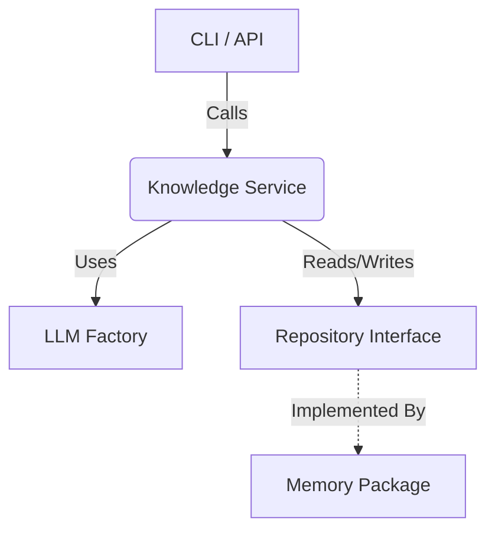

# Knowledge Package

The `knowledge` package serves as the **Intelligence Layer** of TaskWing. It provides semantic search, RAG (Retrieval Augmented Generation), and intelligent ingestion of data.

## Architecture



## Key Components

- **Service** (`service.go`): The main facade.
  - `Search(query)`: Semantic search using vector embeddings.
  - `Ask(query)`: RAG pipeline (Search + LLM Answer).
  - `AddNode(content)`: Intelligent ingestion (Classify + Embed + Save).
- **Ingest** (`ingest.go`): Processes batch findings from agents.
- **Classification** (`classify.go`): Uses LLMs to infer `Type` and `Summary` for raw content.
- **Embeddings** (`embed.go`): Generates vector embeddings for semantic search.

## Usage

```go
// 1. Initialize
// Requires a Repository (from internal/memory) and LLM Config
ks := knowledge.NewService(repo, llmConfig)

// 2. Semantic Search
results, err := ks.Search(ctx, "how does auth work?", 5)

// 3. RAG (Q&A)
answer, err := ks.Ask(ctx, "explain the auth flow", results)

// 4. Add Data (with auto-classification & embedding)
node, err := ks.AddNode(ctx, knowledge.NodeInput{
    Content: "The auth system uses JWT tokens...",
})
```

## Dependencies
- **internal/memory**: Provides the storage implementation.
- **internal/llm**: Provides LLM client abstraction (Eino).
- **internal/agents**: Produces findings that this package ingests.
