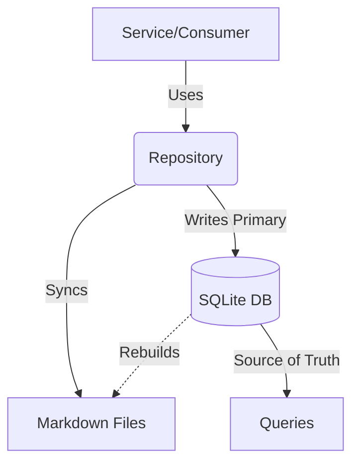

# Memory Package

The `memory` package manages the persistence of the project's knowledge graph. It implements a dual-write architecture where **SQLite is the source of truth** and **Markdown files are a human-readable mirror**.

## Architecture



### Components

- **Repository** (`repository.go`): The main entry point. Orchestrates data synchronization between the DB and filesystem. Always use `NewDefaultRepository` to instantiate.
- **SQLiteStore** (`sqlite.go`): Handles all database operations (CRUD, semantic search, vector storage).
- **MarkdownStore** (`markdown.go`): Manages the `.taskwing/memory/features` directory, ensuring human-readable snapshots of knowledge exist.
- **Models** (`models.go`): Defines core domain types (`Node`, `Feature`, `Decision`).

## Usage

```go
// 1. Initialize
repo, err := memory.NewDefaultRepository(path)
if err != nil {
    log.Fatal(err)
}
defer repo.Close()

// 2. Read (from DB)
node, err := repo.GetNode("n-123")

// 3. Write (DB + File Sync)
err := repo.CreateFeature(feature)
```

## Storage Layout

- `memory.db`: SQLite database (Nodes, Edges, Embeddings).
- `index.json`: Cached summary for fast context loading.
- `features/*.md`: Human-readable markdown files for Features and Decisions.
